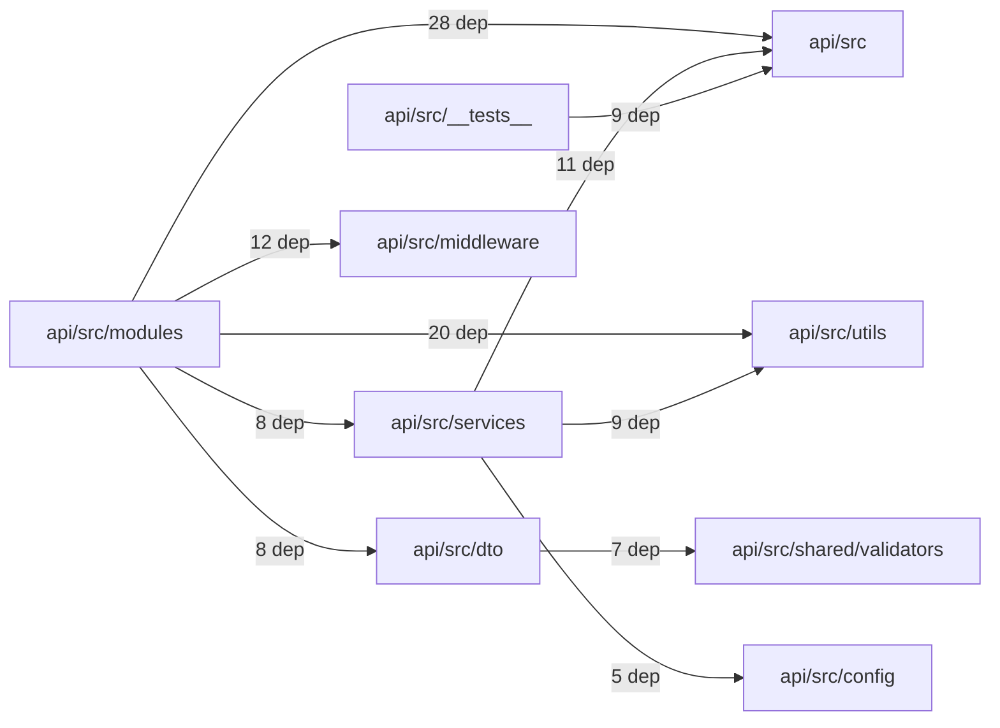

# Workspace @emplus/api

- Overview: [emplus Docs Wiki](../index.md)
- Summary: [SUMMARY](../SUMMARY.md)
- Workspace index: [All workspaces](index.md)
- Feature catalog: [All features](../features/index.md)
- Module index: [All modules](../reference/modules/index.md)

## Snapshot

- Directory: `api`
- Package file: `api/package.json`
- Files: 83
- Symbols: 326
- Languages: `JSON`, `TypeScript`, `YAML`
- Version: `0.1.0`

## Related Features

- [Authentication Login](../features/auth-login.md) - Authentication Login captures the login workflow inside authentication. It spans 2 workspaces. Key flows include Auth login, Auth registration, Auth login.
- [Authentication Read / List](../features/auth-list.md) - Authentication Read / List captures the read / list workflow inside authentication. It spans 3 workspaces.
- [User Management Login](../features/user-login.md) - User Management Login captures the login workflow inside user management. It spans 2 workspaces. Key flows include Auth login, Auth registration, Auth login.
- [Search Read / List](../features/search-list.md) - Search Read / List captures the read / list workflow inside search. It spans 3 workspaces.
- [Search Login](../features/search-login.md) - Search Login captures the login workflow inside search. It spans 2 workspaces. Key flows include Auth login, Auth registration, Auth login.
- [Notifications Read / List](../features/notification-list.md) - Notifications Read / List captures the read / list workflow inside notifications. It spans 2 workspaces.
- [Storage Read / List](../features/storage-list.md) - Storage Read / List captures the read / list workflow inside storage. It spans 4 workspaces.
- [Integrations Read / List](../features/integration-list.md) - Integrations Read / List captures the read / list workflow inside integrations. It spans 3 workspaces.
- [User Management Read / List](../features/user-list.md) - User Management Read / List captures the read / list workflow inside user management. It spans 3 workspaces.
- [Notifications Notify](../features/notification-notify.md) - Notifications Notify captures the notify workflow inside notifications. It spans 2 workspaces.
- [Order Management Login](../features/order-login.md) - Order Management Login captures the login workflow inside order management. It spans 2 workspaces. Key flows include Auth login, Auth login, Auth login.
- [Notifications Login](../features/notification-login.md) - Notifications Login captures the login workflow inside notifications. It spans 2 workspaces. Key flows include Auth login, Auth registration, Auth login.
- [Reporting Read / List](../features/reporting-list.md) - Reporting Read / List captures the read / list workflow inside reporting. It spans 2 workspaces.
- [Search Notify](../features/search-notify.md) - Search Notify captures the notify workflow inside search. It spans 2 workspaces.
- [Storage Login](../features/storage-login.md) - Storage Login captures the login workflow inside storage. It spans 2 workspaces. Key flows include Auth login, Auth registration, Auth login.
- [Administration Read / List](../features/admin-list.md) - Administration Read / List captures the read / list workflow inside administration. It spans 2 workspaces.
- [Authentication Verification](../features/auth-verify.md) - Authentication Verification captures the verification workflow inside authentication. It spans 2 workspaces. Key flows include Credential validation, Auth login, Auth login.
- [Integrations Login](../features/integration-login.md) - Integrations Login captures the login workflow inside integrations. It spans 2 workspaces. Key flows include Auth login, Auth registration, Auth login.
- [Integrations Notify](../features/integration-notify.md) - Integrations Notify captures the notify workflow inside integrations. It spans 2 workspaces.
- [Search Create](../features/search-create.md) - Search Create captures the create workflow inside search. It spans 2 workspaces.
- [User Management Notify](../features/user-notify.md) - User Management Notify captures the notify workflow inside user management. It spans 2 workspaces.
- [Administration Login](../features/admin-login.md) - Administration Login captures the login workflow inside administration. It spans 2 workspaces. Key flows include Auth login, Auth registration, Auth login.
- [Authentication Password Reset](../features/auth-reset.md) - Authentication Password Reset captures the password reset workflow inside authentication. It spans 3 workspaces. Key flows include Password reset, Password reset, Password reset.
- [Storage Notify](../features/storage-notify.md) - Storage Notify captures the notify workflow inside storage. It spans 2 workspaces.
- [User Management Create](../features/user-create.md) - User Management Create captures the create workflow inside user management. It spans 2 workspaces.
- [Order Management Read / List](../features/order-list.md) - Order Management Read / List captures the read / list workflow inside order management. It spans 2 workspaces.
- [Reporting Login](../features/reporting-login.md) - Reporting Login captures the login workflow inside reporting. It spans 2 workspaces. Key flows include Auth login, Auth registration, Auth login.
- [Notifications Verification](../features/notification-verify.md) - Notifications Verification captures the verification workflow inside notifications. It spans 2 workspaces. Key flows include Credential validation, Auth login, Auth login.
- [Storage Verification](../features/storage-verify.md) - Storage Verification captures the verification workflow inside storage. It spans 2 workspaces. Key flows include Credential validation, Auth login, Auth login.
- [Administration Notify](../features/admin-notify.md) - Administration Notify captures the notify workflow inside administration. It spans 2 workspaces.
- [Administration Verification](../features/admin-verify.md) - Administration Verification captures the verification workflow inside administration. It spans 2 workspaces. Key flows include Credential validation, Auth login, Auth login.
- [Integrations Verification](../features/integration-verify.md) - Integrations Verification captures the verification workflow inside integrations. It spans 2 workspaces. Key flows include Credential validation, Auth login, Auth login.
- [Reporting Verification](../features/reporting-verify.md) - Reporting Verification captures the verification workflow inside reporting. It spans 2 workspaces. Key flows include Credential validation, Auth login, Auth login.
- [Order Management Verification](../features/order-verify.md) - Order Management Verification captures the verification workflow inside order management. It spans 2 workspaces. Key flows include Credential validation, Auth login, Auth login.
- [Order Management Notify](../features/order-notify.md) - Order Management Notify captures the notify workflow inside order management. It spans 2 workspaces.

## Basic Design

@emplus/api groups 19 modules that mostly cover authentication and access control, files and storage, search and discovery, external integrations, administration and backoffice, notifications and messaging.

## Flow Highlights

- Auth login - Authenticate the caller, validate credentials, and establish a usable session or token.
- Files &amp; storage flow - Handle the main files and storage use case exposed by this module.
- Files &amp; storage flow - Handle the main files and storage use case exposed by this module.
- Files &amp; storage flow - Handle the main files and storage use case exposed by this module.

## Module Interaction Graph

- `api/src/modules` -> `api/src` (28 dependencies)
- `api/src/modules` -> `api/src/utils` (20 dependencies)
- `api/src/modules` -> `api/src/middleware` (12 dependencies)
- `api/src/services` -> `api/src` (11 dependencies)
- `api/src/__tests__` -> `api/src` (9 dependencies)
- `api/src/services` -> `api/src/utils` (9 dependencies)
- `api/src/modules` -> `api/src/dto` (8 dependencies)
- `api/src/modules` -> `api/src/services` (8 dependencies)
- `api/src/dto` -> `api/src/shared/validators` (7 dependencies)
- `api/src/services` -> `api/src/config` (5 dependencies)

## Modules

- [api](../reference/modules/api.md) - 83 files, 326 symbols
- [api/grafana/provisioning/datasources](../reference/modules/api/grafana/provisioning/datasources.md) - 1 file, 1 symbol
- [api/loki](../reference/modules/api/loki.md) - 1 file, 1 symbol
- [api/scripts](../reference/modules/api/scripts.md) - 1 file, 0 symbols
- [api/src](../reference/modules/api/src.md) - 76 files, 320 symbols
- [api/src/__tests__](../reference/modules/api/src/__tests__.md) - 8 files, 5 symbols
- [api/src/config](../reference/modules/api/src/config.md) - 1 file, 6 symbols
- [api/src/constants](../reference/modules/api/src/constants.md) - 1 file, 0 symbols
- [api/src/db](../reference/modules/api/src/db.md) - 4 files, 26 symbols
- [api/src/dto](../reference/modules/api/src/dto.md) - 8 files, 48 symbols
- [api/src/engines](../reference/modules/api/src/engines.md) - 2 files, 10 symbols
- [api/src/middleware](../reference/modules/api/src/middleware.md) - 5 files, 13 symbols
- [api/src/modules](../reference/modules/api/src/modules.md) - 16 files, 21 symbols
- [api/src/oauth](../reference/modules/api/src/oauth.md) - 1 file, 6 symbols
- [api/src/services](../reference/modules/api/src/services.md) - 11 files, 56 symbols
- [api/src/shared](../reference/modules/api/src/shared.md) - 5 files, 25 symbols
- [api/src/shared/validators](../reference/modules/api/src/shared/validators.md) - 2 files, 10 symbols
- [api/src/store](../reference/modules/api/src/store.md) - 3 files, 64 symbols
- [api/src/utils](../reference/modules/api/src/utils.md) - 6 files, 22 symbols

## Files

- [api/docker-compose.logging.yml](../reference/files/api/docker-compose.logging.yml.md) — Logging configuration for Docker Compose services.
- [api/grafana/provisioning/datasources/datasources.yml](../reference/files/api/grafana/provisioning/datasources/datasources.yml.md) — API Datasource configuration for Loki source in Grafana
- [api/loki/config.yml](../reference/files/api/loki/config.yml.md) — LOKI configuration file syntax and usage
- [api/openapi.json](../reference/files/api/openapi.json.md) — Em+ API structure
- [api/package.json](../reference/files/api/package.json.md) — @emplus/api
- [api/scripts/export-openapi.ts](../reference/files/api/scripts/export-openapi.ts.md) — File containing OpenAPI exporter script syntax for TypeScript.
- [api/src/__tests__/anniversary.test.ts](../reference/files/api/src/__tests__/anniversary.test.ts.md) — Unit tests for anniversary functionality.
- [api/src/__tests__/app.test.ts](../reference/files/api/src/__tests__/app.test.ts.md) — Registers a new user with a profile and returns an access token.
- [api/src/__tests__/auth.test.ts](../reference/files/api/src/__tests__/auth.test.ts.md) — Unit test for authentication functions in API/src/__tests__/auth.ts
- [api/src/__tests__/love-days-utc.test.ts](../reference/files/api/src/__tests__/love-days-utc.test.ts.md) — Calculates the number of days in a love day period from a start date to a current date that is UTC.
- [api/src/__tests__/notifications.test.ts](../reference/files/api/src/__tests__/notifications.test.ts.md) — Source file containing test cases for notifications functionality in an API
- [api/src/__tests__/security_random.test.ts](../reference/files/api/src/__tests__/security_random.test.ts.md) — security_random.test.ts file tests the securityRandom function in src/api
- [api/src/__tests__/system.test.ts](../reference/files/api/src/__tests__/system.test.ts.md) — System configuration file for testing purposes.
- [api/src/__tests__/validation.test.ts](../reference/files/api/src/__tests__/validation.test.ts.md) — Registers a user and retrieves an access token.
- [api/src/app-env.ts](../reference/files/api/src/app-env.ts.md) — app-env.ts metadata and types about environment variables used by the application.
- [api/src/app.ts](../reference/files/api/src/app.ts.md) — TS source file for the application logic in API/src/app
- [api/src/config/env.ts](../reference/files/api/src/config/env.ts.md) — Environment configuration variables and functions for various StoreModes.
- [api/src/constants/index.ts](../reference/files/api/src/constants/index.ts.md) — Constant definitions for the application.
- [api/src/db/bootstrap.ts](../reference/files/api/src/db/bootstrap.ts.md) — Initialize the database connection and schema.
- [api/src/db/migrate.ts](../reference/files/api/src/db/migrate.ts.md) — A migration configuration system for PostgreSQL.
- [api/src/db/seed-custom.ts](../reference/files/api/src/db/seed-custom.ts.md) — Seeds custom user accounts with hardcoded credentials.
- [api/src/db/seed.ts](../reference/files/api/src/db/seed.ts.md) — seed db function to generate and save seeds for couples.
- [api/src/dto/auth.dto.ts](../reference/files/api/src/dto/auth.dto.ts.md) — Functionality to validate and format user input for various types of authentication and login processes.
- [api/src/dto/budget.dto.ts](../reference/files/api/src/dto/budget.dto.ts.md) — Description of the BudgetDTO classes and their interfaces.
- [api/src/dto/care.dto.ts](../reference/files/api/src/dto/care.dto.ts.md) — SaveCycleDto and SaveMoodDto Data Transfer Objects (DTOs)
- [api/src/dto/couples.dto.ts](../reference/files/api/src/dto/couples.dto.ts.md) — Validates the input data for a couple relationship.
- [api/src/dto/live.dto.ts](../reference/files/api/src/dto/live.dto.ts.md) — Provides 2 documented symbols in api/src/dto/live.dto.ts.
- [api/src/dto/notifications.dto.ts](../reference/files/api/src/dto/notifications.dto.ts.md) — ListNotificationsQuery definition, responsible for parsing a JSON object into its constituent parts and extracting lists of notifications.
- [api/src/dto/timeline.dto.ts](../reference/files/api/src/dto/timeline.dto.ts.md) — TimelineQueryDto structure definitions.
- [api/src/dto/user.dto.ts](../reference/files/api/src/dto/user.dto.ts.md) — User Data Transfer Object (DTO) definitions for API endpoints
- [api/src/engines/anniversary.ts](../reference/files/api/src/engines/anniversary.ts.md) — Compute and return upcoming anniversary events for couples
- [api/src/engines/emotional.ts](../reference/files/api/src/engines/emotional.ts.md) — Defines and uses emotional phases and context for various interactions.
- [api/src/index.ts](../reference/files/api/src/index.ts.md) — The main file for an API, providing initial import and configuration.
- [api/src/middleware/auth.ts](../reference/files/api/src/middleware/auth.ts.md) — /api/auth.middleware.requireAuth
- [api/src/middleware/cors.ts](../reference/files/api/src/middleware/cors.ts.md) — Check if the provided origin is localhost or 127.0.0.1 using its hostname
- [api/src/middleware/rate-limit.ts](../reference/files/api/src/middleware/rate-limit.ts.md) — Rate_limitMiddleware class.
- [api/src/middleware/sanitize.ts](../reference/files/api/src/middleware/sanitize.ts.md) — String sanitization handler for API requests.
- [api/src/middleware/security.ts](../reference/files/api/src/middleware/security.ts.md) — Security middleware implementation.
- [api/src/modules/admin.ts](../reference/files/api/src/modules/admin.ts.md) — JS API for the admin module.
- [api/src/modules/auth.ts](../reference/files/api/src/modules/auth.ts.md) — Auth module for authentication-related operations.
- [api/src/modules/budget.ts](../reference/files/api/src/modules/budget.ts.md) — Provides 0 documented symbols in api/src/modules/budget.ts.
- [api/src/modules/care.ts](../reference/files/api/src/modules/care.ts.md) — Function to retrieve a partner from the system.
- [api/src/modules/couples.ts](../reference/files/api/src/modules/couples.ts.md) — Module that interacts with couples API
- [api/src/modules/dashboard.ts](../reference/files/api/src/modules/dashboard.ts.md) — Function to retrieve the number of users in the dashboard data source.
- [api/src/modules/debug.ts](../reference/files/api/src/modules/debug.ts.md) — File contents for the debug module.
- [api/src/modules/demo-in-app-notifications.ts](../reference/files/api/src/modules/demo-in-app-notifications.ts.md) — Provides 2 documented symbols in api/src/modules/demo-in-app-notifications.ts.
- [api/src/modules/demo-timeline-memories.ts](../reference/files/api/src/modules/demo-timeline-memories.ts.md) — File: api/src/modules/demo-timeline-memories.ts
- [api/src/modules/index.ts](../reference/files/api/src/modules/index.ts.md) — Entry point module for the application, typically used as a starting point for other modules.
- [api/src/modules/live.ts](../reference/files/api/src/modules/live.ts.md) — Provides 11 documented symbols in api/src/modules/live.ts.
- [api/src/modules/media.ts](../reference/files/api/src/modules/media.ts.md) — Determines the file extension of a given MIME type for image formats.
- [api/src/modules/notifications.ts](../reference/files/api/src/modules/notifications.ts.md) — Module for handling notifications in the application.
- [api/src/modules/system.ts](../reference/files/api/src/modules/system.ts.md) — Provides 0 documented symbols in api/src/modules/system.ts.
- [api/src/modules/timeline.ts](../reference/files/api/src/modules/timeline.ts.md) — Timeline module
- [api/src/modules/user.ts](../reference/files/api/src/modules/user.ts.md) — User module implementation.
- [api/src/oauth/verify.ts](../reference/files/api/src/oauth/verify.ts.md) — Identifies an identity from an OAuth token and provides fallbacks in case of issues.
- [api/src/services/auth.service.ts](../reference/files/api/src/services/auth.service.ts.md) — Authentication Service API
- [api/src/services/budget.service.ts](../reference/files/api/src/services/budget.service.ts.md) — Budget Service Interface Summary
- [api/src/services/couple.service.ts](../reference/files/api/src/services/couple.service.ts.md) — An endpoint to generate an invite for joining a couple.
- [api/src/services/crypto.ts](../reference/files/api/src/services/crypto.ts.md) — Encryption Key and Mode Resolution
- [api/src/services/dependencies.ts](../reference/files/api/src/services/dependencies.ts.md) — Dependency services for monitoring database, Redis and Minio health
- [api/src/services/mail.ts](../reference/files/api/src/services/mail.ts.md) — API function to send email notifications.
- [api/src/services/media-storage.ts](../reference/files/api/src/services/media-storage.ts.md) — Minio Client and Public Object URL Builder
- [api/src/services/notification.service.ts](../reference/files/api/src/services/notification.service.ts.md) — The `notify` function is an asynchronous API endpoint that creates and sends push or email notifications to users.
- [api/src/services/push.ts](../reference/files/api/src/services/push.ts.md) — The sendExpoPush function sends Expo push notifications.
- [api/src/services/session-cleanup.ts](../reference/files/api/src/services/session-cleanup.ts.md) — Session cleanup function.
- [api/src/services/user.service.ts](../reference/files/api/src/services/user.service.ts.md) — Provides 3 documented symbols in api/src/services/user.service.ts.
- [api/src/shared/code.ts](../reference/files/api/src/shared/code.ts.md) — Code generation functions for numeric and invite code creation using crypto library.
- [api/src/shared/date.ts](../reference/files/api/src/shared/date.ts.md) — Date utilities for formatting and calculating dates in UTF-8
- [api/src/shared/token.ts](../reference/files/api/src/shared/token.ts.md) — Token pair management function with access token and refresh token generation.
- [api/src/shared/validators/index.ts](../reference/files/api/src/shared/validators/index.ts.md) — Validation functions and utilities for the API shared library
- [api/src/shared/validators/zod.ts](../reference/files/api/src/shared/validators/zod.ts.md) — Provides 10 documented symbols in api/src/shared/validators/zod.ts.
- [api/src/store.ts](../reference/files/api/src/store.ts.md) — Creates a new DataStore instance based on environment settings.
- [api/src/store/contracts.ts](../reference/files/api/src/store/contracts.ts.md) — API data store contract
- [api/src/store/in-memory-store.ts](../reference/files/api/src/store/in-memory-store.ts.md) — Provides 63 documented symbols in api/src/store/in-memory-store.ts.
- [api/src/store/index.ts](../reference/files/api/src/store/index.ts.md) — The main entry point of the Redux store.
- [api/src/types.ts](../reference/files/api/src/types.ts.md) — API type and interface documentation.
- [api/src/utils/couple.ts](../reference/files/api/src/utils/couple.ts.md) — Gets the ID of the currently active couple for a given user.
- [api/src/utils/date.ts](../reference/files/api/src/utils/date.ts.md) — A utility file for date-related functions.
- [api/src/utils/http.ts](../reference/files/api/src/utils/http.ts.md) — The `readJson` function is used to read data from request body as JSON.
- [api/src/utils/logger.ts](../reference/files/api/src/utils/logger.ts.md) — Logger API functions for log processing and Loki integration.
- [api/src/utils/password.ts](../reference/files/api/src/utils/password.ts.md) — Hashes a password and returns the encoded query string, including salt and expected digest.
- [api/src/utils/presentation.ts](../reference/files/api/src/utils/presentation.ts.md) — A function that maps a Gender to a corresponding GioiTinhHienThi, according to the given rules.
- [api/tsconfig.json](../reference/files/api/tsconfig.json.md) — TSConfigFile JSON Structure
