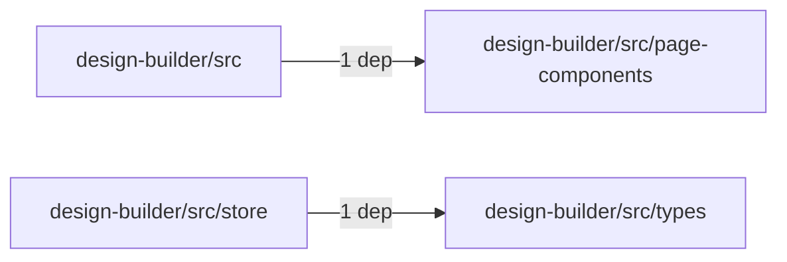

# Workspace @emplus/design-builder

- Overview: [emplus Docs Wiki](../index.md)
- Summary: [SUMMARY](../SUMMARY.md)
- Workspace index: [All workspaces](index.md)
- Feature catalog: [All features](../features/index.md)
- Module index: [All modules](../reference/modules/index.md)

## Snapshot

- Directory: `design-builder`
- Package file: `design-builder/package.json`
- Files: 31
- Symbols: 31
- Languages: `CSS`, `JSON`, `JavaScript`, `TypeScript`
- Version: `1.0.0`

## Related Features

- [Authentication Read / List](../features/auth-list.md) - Authentication Read / List captures the read / list workflow inside authentication. It spans 3 workspaces.
- [Search Read / List](../features/search-list.md) - Search Read / List captures the read / list workflow inside search. It spans 3 workspaces.
- [Storage Read / List](../features/storage-list.md) - Storage Read / List captures the read / list workflow inside storage. It spans 4 workspaces.
- [Integrations Read / List](../features/integration-list.md) - Integrations Read / List captures the read / list workflow inside integrations. It spans 3 workspaces.
- [User Management Read / List](../features/user-list.md) - User Management Read / List captures the read / list workflow inside user management. It spans 3 workspaces.
- [Authentication Password Reset](../features/auth-reset.md) - Authentication Password Reset captures the password reset workflow inside authentication. It spans 3 workspaces. Key flows include Password reset, Password reset, Password reset.
- [Design](../features/design.md) - Design captures the main design behavior discovered in the codebase. Key flows include Design operations flow, Design operations flow.

## Basic Design

@emplus/design-builder groups 9 modules that mostly cover files and storage, authentication and access control, design operations.

## Flow Highlights

- Files Storage listing - Execute the module's listing use case inside files and storage.
- Auth listing - Execute the module's listing use case inside authentication and access control.
- Files &amp; storage flow - Handle the main files and storage use case exposed by this module.
- Auth login - Authenticate the caller, validate credentials, and establish a usable session or token.

## Module Interaction Graph

- `design-builder/src` -> `design-builder/src/page-components` (1 dependencies)
- `design-builder/src/store` -> `design-builder/src/types` (1 dependencies)

## Modules

- [design-builder](../reference/modules/design-builder.md) - 31 files, 31 symbols
- [design-builder/src](../reference/modules/design-builder/src.md) - 22 files, 27 symbols
- [design-builder/src/app](../reference/modules/design-builder/src/app.md) - 3 files, 3 symbols
- [design-builder/src/components](../reference/modules/design-builder/src/components.md) - 12 files, 9 symbols
- [design-builder/src/components/ui](../reference/modules/design-builder/src/components/ui.md) - 8 files, 4 symbols
- [design-builder/src/lib](../reference/modules/design-builder/src/lib.md) - 1 file, 1 symbol
- [design-builder/src/page-components](../reference/modules/design-builder/src/page-components.md) - 1 file, 1 symbol
- [design-builder/src/store](../reference/modules/design-builder/src/store.md) - 1 file, 1 symbol
- [design-builder/src/types](../reference/modules/design-builder/src/types.md) - 1 file, 10 symbols

## Files

- [design-builder/components.json](../reference/files/design-builder/components.json.md) — JSON schema definition for components file
- [design-builder/next-env.d.ts](../reference/files/design-builder/next-env.d.ts.md) — Provides 0 documented symbols in design-builder/next-env.d.ts.
- [design-builder/next.config.js](../reference/files/design-builder/next.config.js.md) — Next.config.js configuration file for the design-builder library.
- [design-builder/package.json](../reference/files/design-builder/package.json.md) — The @emplus/design-builder/package.json file holds metadata and dependencies for the design-builder project.
- [design-builder/postcss.config.js](../reference/files/design-builder/postcss.config.js.md) — Configuration file for PostCSS plugin design-builder
- [design-builder/src/App.tsx](../reference/files/design-builder/src/App.tsx.md) — The main application component, handling the user interface layout and toaster notifications.
- [design-builder/src/app/globals.css](../reference/files/design-builder/src/app/globals.css.md) — globals.css
- [design-builder/src/app/layout.tsx](../reference/files/design-builder/src/app/layout.tsx.md) — The RootLayout component is a functional React component that returns an HTML template.
- [design-builder/src/app/page.tsx](../reference/files/design-builder/src/app/page.tsx.md) — The Home page component of the design-builder app.
- [design-builder/src/components/export-dialog.tsx](../reference/files/design-builder/src/components/export-dialog.tsx.md) — exposes export dialog functionality
- [design-builder/src/components/theme-preview.tsx](../reference/files/design-builder/src/components/theme-preview.tsx.md) — A function component that renders a theme preview with customizable colors and tokens.
- [design-builder/src/components/token-category-list.tsx](../reference/files/design-builder/src/components/token-category-list.tsx.md) — A React functional component that renders a list of categories with their icons and labels.
- [design-builder/src/components/token-editor.tsx](../reference/files/design-builder/src/components/token-editor.tsx.md) — The TokenEditor component provides a text area for editing and managing tokens in the design-builder.
- [design-builder/src/components/ui/button.tsx](../reference/files/design-builder/src/components/ui/button.tsx.md) — Button component props.
- [design-builder/src/components/ui/card.tsx](../reference/files/design-builder/src/components/ui/card.tsx.md) — DesignBuilder UI Card component.
- [design-builder/src/components/ui/input.tsx](../reference/files/design-builder/src/components/ui/input.tsx.md) — The `InputProps` interface defines the properties that can be passed to an HTML input element
- [design-builder/src/components/ui/label.tsx](../reference/files/design-builder/src/components/ui/label.tsx.md) — A semantic label component used to display a string as text.
- [design-builder/src/components/ui/scroll-area.tsx](../reference/files/design-builder/src/components/ui/scroll-area.tsx.md) — Scroll area component properties and usage.
- [design-builder/src/components/ui/sonner.tsx](../reference/files/design-builder/src/components/ui/sonner.tsx.md) — The Toaster component constructor in Sonner UI.
- [design-builder/src/components/ui/switch.tsx](../reference/files/design-builder/src/components/ui/switch.tsx.md) — Switch component in UI.
- [design-builder/src/components/ui/tabs.tsx](../reference/files/design-builder/src/components/ui/tabs.tsx.md) — Tabs component
- [design-builder/src/index.css](../reference/files/design-builder/src/index.css.md) — The index.css file defines constants and utilities for a design-builder component.
- [design-builder/src/lib/utils.ts](../reference/files/design-builder/src/lib/utils.ts.md) — Builds a design-builder by merging input models using twMerge.
- [design-builder/src/main.tsx](../reference/files/design-builder/src/main.tsx.md) — Main file of the design-builder project.
- [design-builder/src/page-components/builder-page.tsx](../reference/files/design-builder/src/page-components/builder-page.tsx.md) — Builders Page component
- [design-builder/src/store/builder-store.ts](../reference/files/design-builder/src/store/builder-store.ts.md) — BuilderStore interface
- [design-builder/src/types/tokens.ts](../reference/files/design-builder/src/types/tokens.ts.md) — Provides 10 documented symbols in design-builder/src/types/tokens.ts.
- [design-builder/tailwind.config.js](../reference/files/design-builder/tailwind.config.js.md) — Tailwind configuration file for design-builder
- [design-builder/tsconfig.json](../reference/files/design-builder/tsconfig.json.md) — tsconfig.json file configuration
- [design-builder/tsconfig.node.json](../reference/files/design-builder/tsconfig.node.json.md) — TSconfig node.json file contents
- [design-builder/vite.config.ts](../reference/files/design-builder/vite.config.ts.md) — Vite configuration file for the design-builder library.
