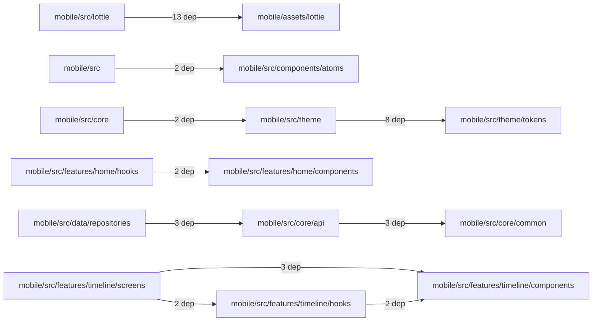

# Workspace @emplus/mobile

- Overview: [emplus Docs Wiki](../index.md)
- Summary: [SUMMARY](../SUMMARY.md)
- Workspace index: [All workspaces](index.md)
- Feature catalog: [All features](../features/index.md)
- Module index: [All modules](../reference/modules/index.md)

## Snapshot

- Directory: `mobile`
- Package file: `mobile/package.json`
- Files: 243
- Symbols: 654
- Languages: `JSON`, `JavaScript`, `Kotlin`, `Swift`, `TypeScript`
- Version: `0.1.0`

## Related Features

- [Authentication Login](../features/auth-login.md) - Authentication Login captures the login workflow inside authentication. It spans 2 workspaces. Key flows include Auth login, Auth registration, Auth login.
- [Authentication Read / List](../features/auth-list.md) - Authentication Read / List captures the read / list workflow inside authentication. It spans 3 workspaces.
- [User Management Login](../features/user-login.md) - User Management Login captures the login workflow inside user management. It spans 2 workspaces. Key flows include Auth login, Auth registration, Auth login.
- [Search Read / List](../features/search-list.md) - Search Read / List captures the read / list workflow inside search. It spans 3 workspaces.
- [Search Login](../features/search-login.md) - Search Login captures the login workflow inside search. It spans 2 workspaces. Key flows include Auth login, Auth registration, Auth login.
- [Notifications Read / List](../features/notification-list.md) - Notifications Read / List captures the read / list workflow inside notifications. It spans 2 workspaces.
- [Storage Read / List](../features/storage-list.md) - Storage Read / List captures the read / list workflow inside storage. It spans 4 workspaces.
- [Integrations Read / List](../features/integration-list.md) - Integrations Read / List captures the read / list workflow inside integrations. It spans 3 workspaces.
- [User Management Read / List](../features/user-list.md) - User Management Read / List captures the read / list workflow inside user management. It spans 3 workspaces.
- [Notifications Notify](../features/notification-notify.md) - Notifications Notify captures the notify workflow inside notifications. It spans 2 workspaces.
- [Order Management Login](../features/order-login.md) - Order Management Login captures the login workflow inside order management. It spans 2 workspaces. Key flows include Auth login, Auth login, Auth login.
- [Notifications Login](../features/notification-login.md) - Notifications Login captures the login workflow inside notifications. It spans 2 workspaces. Key flows include Auth login, Auth registration, Auth login.
- [Reporting Read / List](../features/reporting-list.md) - Reporting Read / List captures the read / list workflow inside reporting. It spans 2 workspaces.
- [Search Notify](../features/search-notify.md) - Search Notify captures the notify workflow inside search. It spans 2 workspaces.
- [Storage Login](../features/storage-login.md) - Storage Login captures the login workflow inside storage. It spans 2 workspaces. Key flows include Auth login, Auth registration, Auth login.
- [Administration Read / List](../features/admin-list.md) - Administration Read / List captures the read / list workflow inside administration. It spans 2 workspaces.
- [Authentication Verification](../features/auth-verify.md) - Authentication Verification captures the verification workflow inside authentication. It spans 2 workspaces. Key flows include Credential validation, Auth login, Auth login.
- [Integrations Login](../features/integration-login.md) - Integrations Login captures the login workflow inside integrations. It spans 2 workspaces. Key flows include Auth login, Auth registration, Auth login.
- [Integrations Notify](../features/integration-notify.md) - Integrations Notify captures the notify workflow inside integrations. It spans 2 workspaces.
- [Search Create](../features/search-create.md) - Search Create captures the create workflow inside search. It spans 2 workspaces.
- [User Management Notify](../features/user-notify.md) - User Management Notify captures the notify workflow inside user management. It spans 2 workspaces.
- [Administration Login](../features/admin-login.md) - Administration Login captures the login workflow inside administration. It spans 2 workspaces. Key flows include Auth login, Auth registration, Auth login.
- [Authentication Password Reset](../features/auth-reset.md) - Authentication Password Reset captures the password reset workflow inside authentication. It spans 3 workspaces. Key flows include Password reset, Password reset, Password reset.
- [Storage Notify](../features/storage-notify.md) - Storage Notify captures the notify workflow inside storage. It spans 2 workspaces.
- [User Management Create](../features/user-create.md) - User Management Create captures the create workflow inside user management. It spans 2 workspaces.
- [Order Management Read / List](../features/order-list.md) - Order Management Read / List captures the read / list workflow inside order management. It spans 2 workspaces.
- [Reporting Login](../features/reporting-login.md) - Reporting Login captures the login workflow inside reporting. It spans 2 workspaces. Key flows include Auth login, Auth registration, Auth login.
- [Notifications Verification](../features/notification-verify.md) - Notifications Verification captures the verification workflow inside notifications. It spans 2 workspaces. Key flows include Credential validation, Auth login, Auth login.
- [Storage Verification](../features/storage-verify.md) - Storage Verification captures the verification workflow inside storage. It spans 2 workspaces. Key flows include Credential validation, Auth login, Auth login.
- [Administration Notify](../features/admin-notify.md) - Administration Notify captures the notify workflow inside administration. It spans 2 workspaces.
- [Administration Verification](../features/admin-verify.md) - Administration Verification captures the verification workflow inside administration. It spans 2 workspaces. Key flows include Credential validation, Auth login, Auth login.
- [Integrations Verification](../features/integration-verify.md) - Integrations Verification captures the verification workflow inside integrations. It spans 2 workspaces. Key flows include Credential validation, Auth login, Auth login.
- [Reporting Verification](../features/reporting-verify.md) - Reporting Verification captures the verification workflow inside reporting. It spans 2 workspaces. Key flows include Credential validation, Auth login, Auth login.
- [Order Management Verification](../features/order-verify.md) - Order Management Verification captures the verification workflow inside order management. It spans 2 workspaces. Key flows include Credential validation, Auth login, Auth login.
- [Order Management Notify](../features/order-notify.md) - Order Management Notify captures the notify workflow inside order management. It spans 2 workspaces.
- [Mobile](../features/mobile.md) - Mobile captures the main mobile behavior discovered in the codebase. Key flows include Mobile operations flow, Mobile operations flow.

## Basic Design

@emplus/mobile groups 62 modules that mostly cover authentication and access control, files and storage, notifications and messaging, search and discovery, administration and backoffice, user and profile management, mobile operations.

## Flow Highlights

- Auth login - Authenticate the caller, validate credentials, and establish a usable session or token.
- Files &amp; storage flow - Handle the main files and storage use case exposed by this module.
- Auth login - Authenticate the caller, validate credentials, and establish a usable session or token.
- Auth login - Authenticate the caller, validate credentials, and establish a usable session or token.

## Module Interaction Graph

- `mobile/src/lottie` -> `mobile/assets/lottie` (13 dependencies)
- `mobile/src/theme` -> `mobile/src/theme/tokens` (8 dependencies)
- `mobile/src/core/api` -> `mobile/src/core/common` (3 dependencies)
- `mobile/src/data/repositories` -> `mobile/src/core/api` (3 dependencies)
- `mobile/src/features/timeline/screens` -> `mobile/src/features/timeline/components` (3 dependencies)
- `mobile/src` -> `mobile/src/components/atoms` (2 dependencies)
- `mobile/src/core` -> `mobile/src/theme` (2 dependencies)
- `mobile/src/features/home/hooks` -> `mobile/src/features/home/components` (2 dependencies)
- `mobile/src/features/timeline/hooks` -> `mobile/src/features/timeline/components` (2 dependencies)
- `mobile/src/features/timeline/screens` -> `mobile/src/features/timeline/hooks` (2 dependencies)

## Modules

- [mobile](../reference/modules/mobile.md) - 243 files, 654 symbols
- [mobile/android/app/src/main/java/com/truongdq/emplus](../reference/modules/mobile/android/app/src/main/java/com/truongdq/emplus.md) - 2 files, 2 symbols
- [mobile/app](../reference/modules/mobile/app.md) - 24 files, 54 symbols
- [mobile/app/(tabs)](../reference/modules/mobile/app/tabs--7761ed0d.md) - 6 files, 19 symbols
- [mobile/app/memory](../reference/modules/mobile/app/memory.md) - 1 file, 1 symbol
- [mobile/app/profile-details](../reference/modules/mobile/app/profile-details.md) - 5 files, 12 symbols
- [mobile/assets/lottie](../reference/modules/mobile/assets/lottie.md) - 13 files, 13 symbols
- [mobile/ios](../reference/modules/mobile/ios.md) - 6 files, 6 symbols
- [mobile/ios/Em](../reference/modules/mobile/ios/Em.md) - 5 files, 5 symbols
- [mobile/ios/Em/Images.xcassets](../reference/modules/mobile/ios/Em/Images.xcassets.md) - 4 files, 4 symbols
- [mobile/ios/Em/Images.xcassets/AppIcon.appiconset](../reference/modules/mobile/ios/Em/Images.xcassets/AppIcon.appiconset.md) - 1 file, 1 symbol
- [mobile/ios/Em/Images.xcassets/SplashScreenBackground.colorset](../reference/modules/mobile/ios/Em/Images.xcassets/SplashScreenBackground.colorset.md) - 1 file, 1 symbol
- [mobile/ios/Em/Images.xcassets/SplashScreenLegacy.imageset](../reference/modules/mobile/ios/Em/Images.xcassets/SplashScreenLegacy.imageset.md) - 1 file, 1 symbol
- [mobile/scripts](../reference/modules/mobile/scripts.md) - 2 files, 4 symbols
- [mobile/src](../reference/modules/mobile/src.md) - 188 files, 570 symbols
- [mobile/src/animations](../reference/modules/mobile/src/animations.md) - 3 files, 10 symbols
- [mobile/src/components](../reference/modules/mobile/src/components.md) - 34 files, 103 symbols
- [mobile/src/components/atoms](../reference/modules/mobile/src/components/atoms.md) - 13 files, 49 symbols
- [mobile/src/components/glass](../reference/modules/mobile/src/components/glass.md) - 3 files, 10 symbols
- [mobile/src/components/molecules](../reference/modules/mobile/src/components/molecules.md) - 11 files, 27 symbols
- [mobile/src/components/molecules/pickers](../reference/modules/mobile/src/components/molecules/pickers.md) - 7 files, 21 symbols
- [mobile/src/components/organisms](../reference/modules/mobile/src/components/organisms.md) - 4 files, 9 symbols
- [mobile/src/components/templates](../reference/modules/mobile/src/components/templates.md) - 1 file, 0 symbols
- [mobile/src/core](../reference/modules/mobile/src/core.md) - 16 files, 47 symbols
- [mobile/src/core/api](../reference/modules/mobile/src/core/api.md) - 7 files, 35 symbols
- [mobile/src/core/common](../reference/modules/mobile/src/core/common.md) - 4 files, 5 symbols
- [mobile/src/core/config](../reference/modules/mobile/src/core/config.md) - 3 files, 1 symbol
- [mobile/src/data/repositories](../reference/modules/mobile/src/data/repositories.md) - 3 files, 34 symbols
- [mobile/src/domain/repositories](../reference/modules/mobile/src/domain/repositories.md) - 3 files, 8 symbols
- [mobile/src/domain/usecases](../reference/modules/mobile/src/domain/usecases.md) - 3 files, 81 symbols
- [mobile/src/domain/usecases/auth](../reference/modules/mobile/src/domain/usecases/auth.md) - 1 file, 27 symbols
- [mobile/src/domain/usecases/modules](../reference/modules/mobile/src/domain/usecases/modules.md) - 1 file, 54 symbols
- [mobile/src/features/auth](../reference/modules/mobile/src/features/auth.md) - 30 files, 38 symbols
- [mobile/src/features/auth/components](../reference/modules/mobile/src/features/auth/components.md) - 23 files, 35 symbols
- [mobile/src/features/auth/hooks](../reference/modules/mobile/src/features/auth/hooks.md) - 1 file, 1 symbol
- [mobile/src/features/budget](../reference/modules/mobile/src/features/budget.md) - 10 files, 11 symbols
- [mobile/src/features/budget/components](../reference/modules/mobile/src/features/budget/components.md) - 8 files, 10 symbols
- [mobile/src/features/budget/hooks](../reference/modules/mobile/src/features/budget/hooks.md) - 1 file, 1 symbol
- [mobile/src/features/home](../reference/modules/mobile/src/features/home.md) - 13 files, 23 symbols
- [mobile/src/features/home/components](../reference/modules/mobile/src/features/home/components.md) - 10 files, 21 symbols
- [mobile/src/features/home/hooks](../reference/modules/mobile/src/features/home/hooks.md) - 1 file, 2 symbols
- [mobile/src/features/live](../reference/modules/mobile/src/features/live.md) - 2 files, 8 symbols
- [mobile/src/features/mood](../reference/modules/mobile/src/features/mood.md) - 3 files, 10 symbols
- [mobile/src/features/mood/components](../reference/modules/mobile/src/features/mood/components.md) - 1 file, 8 symbols
- [mobile/src/features/notifications](../reference/modules/mobile/src/features/notifications.md) - 1 file, 2 symbols
- [mobile/src/features/pairing](../reference/modules/mobile/src/features/pairing.md) - 5 files, 6 symbols
- [mobile/src/features/profile/components](../reference/modules/mobile/src/features/profile/components.md) - 2 files, 4 symbols
- [mobile/src/features/timeline](../reference/modules/mobile/src/features/timeline.md) - 16 files, 25 symbols
- [mobile/src/features/timeline/components](../reference/modules/mobile/src/features/timeline/components.md) - 12 files, 22 symbols
- [mobile/src/features/timeline/hooks](../reference/modules/mobile/src/features/timeline/hooks.md) - 2 files, 2 symbols
- [mobile/src/features/timeline/screens](../reference/modules/mobile/src/features/timeline/screens.md) - 1 file, 1 symbol
- [mobile/src/framework/ctx](../reference/modules/mobile/src/framework/ctx.md) - 2 files, 6 symbols
- [mobile/src/framework/di](../reference/modules/mobile/src/framework/di.md) - 1 file, 0 symbols
- [mobile/src/hooks](../reference/modules/mobile/src/hooks.md) - 2 files, 10 symbols
- [mobile/src/lib](../reference/modules/mobile/src/lib.md) - 1 file, 4 symbols
- [mobile/src/lottie](../reference/modules/mobile/src/lottie.md) - 1 file, 1 symbol
- [mobile/src/presentation/hooks/auth](../reference/modules/mobile/src/presentation/hooks/auth.md) - 6 files, 8 symbols
- [mobile/src/presentation/hooks/notifications](../reference/modules/mobile/src/presentation/hooks/notifications.md) - 1 file, 3 symbols
- [mobile/src/theme](../reference/modules/mobile/src/theme.md) - 13 files, 40 symbols
- [mobile/src/theme/tokens](../reference/modules/mobile/src/theme/tokens.md) - 3 files, 7 symbols
- [mobile/src/types](../reference/modules/mobile/src/types.md) - 2 files, 7 symbols
- [mobile/src/utils](../reference/modules/mobile/src/utils.md) - 9 files, 44 symbols

## Files

- [mobile/android/app/src/main/java/com/truongdq/emplus/MainActivity.kt](../reference/files/mobile/android/app/src/main/java/com/truongdq/emplus/MainActivity.kt.md) — The MainActivity is the entry point of an Android app built using React Native.
- [mobile/android/app/src/main/java/com/truongdq/emplus/MainApplication.kt](../reference/files/mobile/android/app/src/main/java/com/truongdq/emplus/MainApplication.kt.md) — MainApplication class is the entry point of an Android application built with Expo
- [mobile/app.json](../reference/files/mobile/app.json.md) — main app file for Expo EM+ project.
- [mobile/app/_layout.tsx](../reference/files/mobile/app/_layout.tsx.md) — ErrorBoundary component handles error situations and provides an optional fallback screen
- [mobile/app/(tabs)/_layout.tsx](../reference/files/mobile/app/tabs--7761ed0d/_layout.tsx.md) — A function that returns the icon for a given route in the Ionicons library.
- [mobile/app/(tabs)/care.tsx](../reference/files/mobile/app/tabs--7761ed0d/care.tsx.md) — A function that creates a care-themed UI component.
- [mobile/app/(tabs)/home.tsx](../reference/files/mobile/app/tabs--7761ed0d/home.tsx.md) — The HomeScreen component is responsible for rendering the basic layout of the app's home screen.
- [mobile/app/(tabs)/notifications.tsx](../reference/files/mobile/app/tabs--7761ed0d/notifications.tsx.md) — NotificationsScreen function
- [mobile/app/(tabs)/profile.tsx](../reference/files/mobile/app/tabs--7761ed0d/profile.tsx.md) — The ProfileScreen component renders a user profile screen with various settings and functionality.
- [mobile/app/(tabs)/timeline.tsx](../reference/files/mobile/app/tabs--7761ed0d/timeline.tsx.md) — Defines and manages the state for a timeline screen in an authentication gate.
- [mobile/app/add-expense.tsx](../reference/files/mobile/app/add-expense.tsx.md) — Add Expense Screen function returns AddExpenseScene object
- [mobile/app/add-memory.tsx](../reference/files/mobile/app/add-memory.tsx.md) — The `AddMemoryScreen` function creates a new memory screen with a title, date, note, and options for adding or selecting assets.
- [mobile/app/forgot-password.tsx](../reference/files/mobile/app/forgot-password.tsx.md) — The ForgotPasswordScreen function component in the mobile/app/forgot-password.tsx file.
- [mobile/app/index.tsx](../reference/files/mobile/app/index.tsx.md) — The Index component displays a login or redirect UI based on user state
- [mobile/app/login.tsx](../reference/files/mobile/app/login.tsx.md) — Login screen component for user authentication.
- [mobile/app/memory/[id].tsx](../reference/files/mobile/app/memory/param-id--bb6303db.tsx.md)
- [mobile/app/pairing.tsx](../reference/files/mobile/app/pairing.tsx.md) — function:symbol:0
- [mobile/app/policy.tsx](../reference/files/mobile/app/policy.tsx.md) — Section props interface in mobile/app/policy.tsx
- [mobile/app/profile-details/appearance.tsx](../reference/files/mobile/app/profile-details/appearance.tsx.md) — AppearanceScreen function returns a styled application layout with customizable themes, colors, and styling.
- [mobile/app/profile-details/help.tsx](../reference/files/mobile/app/profile-details/help.tsx.md) — The HelpScreen function creates a component for displaying help information at the bottom of the mobile screen.
- [mobile/app/profile-details/notifications.tsx](../reference/files/mobile/app/profile-details/notifications.tsx.md) — The NotificationsScreen function provides the necessary state and functionality to display and handle notifications in a mobile app.
- [mobile/app/profile-details/personal-info.tsx](../reference/files/mobile/app/profile-details/personal-info.tsx.md) — PersonalInfoScreen function generates and manages user profile information data.
- [mobile/app/profile-details/privacy.tsx](../reference/files/mobile/app/profile-details/privacy.tsx.md) — The `PrivacyScreen` class is responsible for rendering the privacy settings screen in an application.
- [mobile/app/register.tsx](../reference/files/mobile/app/register.tsx.md) — The RegisterScreen function configuration
- [mobile/app/reset-password.tsx](../reference/files/mobile/app/reset-password.tsx.md) — Resets the user's password after a failed email login attempt.
- [mobile/app/theme-showcase.tsx](../reference/files/mobile/app/theme-showcase.tsx.md) — The ThemeShowcaseScreen function represents the main screen of the app, designed to showcase different themes and allow users to switch between them.
- [mobile/app/verify-otp.tsx](../reference/files/mobile/app/verify-otp.tsx.md) — The VerifyOtpScreen function renders a screen with OTP verification options.
- [mobile/assets/lottie/care-heart.json](../reference/files/mobile/assets/lottie/care-heart.json.md)
- [mobile/assets/lottie/empty.json](../reference/files/mobile/assets/lottie/empty.json.md) — {"v":"5.7.4","fr":"30","ip":0,"op":30,"w":200,"h":200,"nm":"Empløs","ddd":0,"assets":[],"layers":[{"ddd":0,"ind":1,"ty":4,"nm":"dot","sr":1,"ks":{"o":{"a":0,"k":100},"r":{"a":1,"k":[{Ùx:[0.667],Ùy:[1]}],"o":{"x:[0.333],&amp;quot;y:[0]},"t":0,"s":[0]},{tan}:30,"s":[360]}"],
- [mobile/assets/lottie/error.json](../reference/files/mobile/assets/lottie/error.json.md) — Provides 1 documented symbol in mobile/assets/lottie/error.json.
- [mobile/assets/lottie/home-counter-bird-pair-sky.json](../reference/files/mobile/assets/lottie/home-counter-bird-pair-sky.json.md) — %s string %s - Layer 10 parameters%n
- [mobile/assets/lottie/loader.json](../reference/files/mobile/assets/lottie/loader.json.md) — Lottie loader configuration info
- [mobile/assets/lottie/login-cat-love.json](../reference/files/mobile/assets/lottie/login-cat-love.json.md) — Lottie animation configuration file for a cat love logo.
- [mobile/assets/lottie/notifications-empty-cat.json](../reference/files/mobile/assets/lottie/notifications-empty-cat.json.md) — File containing notifications for an empty cat.
- [mobile/assets/lottie/pairing-family-love.json](../reference/files/mobile/assets/lottie/pairing-family-love.json.md) — The pairing family love configuration for Lottie assets.
- [mobile/assets/lottie/placeholder.json](../reference/files/mobile/assets/lottie/placeholder.json.md) — Placeholder for Lottie animation files
- [mobile/assets/lottie/register-love-hearts.json](../reference/files/mobile/assets/lottie/register-love-hearts.json.md) — Provides 1 documented symbol in mobile/assets/lottie/register-love-hearts.json.
- [mobile/assets/lottie/success.json](../reference/files/mobile/assets/lottie/success.json.md) — Lottie success file data structure
- [mobile/assets/lottie/timeline-empty-love.json](../reference/files/mobile/assets/lottie/timeline-empty-love.json.md) — Lottie Timeline Empty Love symbol in a Lottie animation
- [mobile/assets/lottie/verify-otp-password-auth.json](../reference/files/mobile/assets/lottie/verify-otp-password-auth.json.md) — String value corresponding to verified OTP password authentication
- [mobile/babel.config.js](../reference/files/mobile/babel.config.js.md) — The configuration file for the Babel team.
- [mobile/eas.json](../reference/files/mobile/eas.json.md) — JSON Configuration File
- [mobile/index.js](../reference/files/mobile/index.js.md) — The index file for the mobile application.
- [mobile/ios/Em/AppDelegate.swift](../reference/files/mobile/ios/Em/AppDelegate.swift.md) — AppDelegate class for iOS and tvOS applications using Expo.
- [mobile/ios/Em/Images.xcassets/AppIcon.appiconset/Contents.json](../reference/files/mobile/ios/Em/Images.xcassets/AppIcon.appiconset/Contents.json.md) — File structure summary of the AppIcon.appiconset/Contents.json file in an Expo project
- [mobile/ios/Em/Images.xcassets/Contents.json](../reference/files/mobile/ios/Em/Images.xcassets/Contents.json.md) — Contents file for EmImages.xcassets in an iOS project.
- [mobile/ios/Em/Images.xcassets/SplashScreenBackground.colorset/Contents.json](../reference/files/mobile/ios/Em/Images.xcassets/SplashScreenBackground.colorset/Contents.json.md) — The color set documentation for the SplashScreenBackground in iOS and mobile applications.
- [mobile/ios/Em/Images.xcassets/SplashScreenLegacy.imageset/Contents.json](../reference/files/mobile/ios/Em/Images.xcassets/SplashScreenLegacy.imageset/Contents.json.md) — A JSON describing a SplashScreenLegacy imageset in an EmImages.xcassets file.
- [mobile/ios/Podfile.properties.json](../reference/files/mobile/ios/Podfile.properties.json.md) — Mobile iOS Podfile properties file.
- [mobile/metro.config.js](../reference/files/mobile/metro.config.js.md) — Configuration file for mobile/metro project.
- [mobile/package.json](../reference/files/mobile/package.json.md) — mobile/package.json file
- [mobile/scripts/fix-flow-syntax.js](../reference/files/mobile/scripts/fix-flow-syntax.js.md) — File that checks and transforms React Native project files with flow syntax.
- [mobile/scripts/sync-api.ts](../reference/files/mobile/scripts/sync-api.ts.md) — Provides 1 documented symbol in mobile/scripts/sync-api.ts.
- [mobile/src/alert-dialog-context.tsx](../reference/files/mobile/src/alert-dialog-context.tsx.md) — AlertDialogProvider is a React component that provides the AlertDialogContextValue function and DialogState type.
- [mobile/src/animations/hooks.ts](../reference/files/mobile/src/animations/hooks.ts.md) — Hooks for animation-related functionality.
- [mobile/src/animations/motion-presets.ts](../reference/files/mobile/src/animations/motion-presets.ts.md) — Motion presets with animated motion effects.
- [mobile/src/animations/presets.ts](../reference/files/mobile/src/animations/presets.ts.md) — The `useEntranceAnimation` function generates an animated transition effect when the user navigates to a new screen.
- [mobile/src/api.ts](../reference/files/mobile/src/api.ts.md) — API Functionality for User Authentication
- [mobile/src/components/AnimatedSplashScreen.tsx](../reference/files/mobile/src/components/AnimatedSplashScreen.tsx.md) — AnimatedSplashScreen component
- [mobile/src/components/atoms/Avatar.tsx](../reference/files/mobile/src/components/atoms/Avatar.tsx.md) — Retrieves a color from an avatar's name
- [mobile/src/components/atoms/Badge.tsx](../reference/files/mobile/src/components/atoms/Badge.tsx.md) — Badge component properties and usage notes.
- [mobile/src/components/atoms/BottomSheet.tsx](../reference/files/mobile/src/components/atoms/BottomSheet.tsx.md) — BottomSheetComponent
- [mobile/src/components/atoms/Button.tsx](../reference/files/mobile/src/components/atoms/Button.tsx.md) — The Button component represents a button in React Native
- [mobile/src/components/atoms/Checkbox.tsx](../reference/files/mobile/src/components/atoms/Checkbox.tsx.md) — A checkbox component that allows the user to toggle a boolean value.
- [mobile/src/components/atoms/EmplusLottie.tsx](../reference/files/mobile/src/components/atoms/EmplusLottie.tsx.md) — Provides 2 documented symbols in mobile/src/components/atoms/EmplusLottie.tsx.
- [mobile/src/components/atoms/index.ts](../reference/files/mobile/src/components/atoms/index.ts.md) — Primary component index file
- [mobile/src/components/atoms/Input.tsx](../reference/files/mobile/src/components/atoms/Input.tsx.md) — Input component properties
- [mobile/src/components/atoms/InputErrorLeadingIcon.tsx](../reference/files/mobile/src/components/atoms/InputErrorLeadingIcon.tsx.md) — A reusable InputErrorLeadingIcon component that renders an Ionicons alert-circle icon when the provided error string is empty.
- [mobile/src/components/atoms/Skeleton.tsx](../reference/files/mobile/src/components/atoms/Skeleton.tsx.md) — The getBorderRadius function returns a border radius based on the given SkeletonVariant.
- [mobile/src/components/atoms/Switch.tsx](../reference/files/mobile/src/components/atoms/Switch.tsx.md) — A component that exhibits a 'Switch' behavior, controlling an underlying state or action.
- [mobile/src/components/atoms/Text.tsx](../reference/files/mobile/src/components/atoms/Text.tsx.md) — A React Native component for rendering text in various styles and sizes.
- [mobile/src/components/atoms/Toast.tsx](../reference/files/mobile/src/components/atoms/Toast.tsx.md) — Toast component implementation
- [mobile/src/components/glass/GlassCard.tsx](../reference/files/mobile/src/components/glass/GlassCard.tsx.md) — The GlassCard component is a card component that displays content and can be customized with various props.
- [mobile/src/components/glass/index.ts](../reference/files/mobile/src/components/glass/index.ts.md) — The index file for the Glass component.
- [mobile/src/components/glass/LiquidGlassView.tsx](../reference/files/mobile/src/components/glass/LiquidGlassView.tsx.md) — The LiquidGlassView component renders a glassy view with customizable properties and behavior.
- [mobile/src/components/molecules/Card.tsx](../reference/files/mobile/src/components/molecules/Card.tsx.md) — A React component representing a card layer with customizable props.
- [mobile/src/components/molecules/index.ts](../reference/files/mobile/src/components/molecules/index.ts.md) — File containing the definition of an index molecule in a mobile-specific component.
- [mobile/src/components/molecules/LottieHero.tsx](../reference/files/mobile/src/components/molecules/LottieHero.tsx.md) — LottieHero component props
- [mobile/src/components/molecules/pickers/calendar-day-cell.tsx](../reference/files/mobile/src/components/molecules/pickers/calendar-day-cell.tsx.md) — void
- [mobile/src/components/molecules/pickers/calendar-utils.ts](../reference/files/mobile/src/components/molecules/pickers/calendar-utils.ts.md) — Date utilities for mobile application
- [mobile/src/components/molecules/pickers/date-picker-sheet.tsx](../reference/files/mobile/src/components/molecules/pickers/date-picker-sheet.tsx.md) — DatePickerSheet function component responsible for managing a date picker sheet with picker steps, selected date model, and header icon.
- [mobile/src/components/molecules/pickers/index.ts](../reference/files/mobile/src/components/molecules/pickers/index.ts.md) — picker component implementation details
- [mobile/src/components/molecules/pickers/picker-modal-overlay.tsx](../reference/files/mobile/src/components/molecules/pickers/picker-modal-overlay.tsx.md) — The `PickerModalOverlay` is a functional React component that renders a modal overlay.
- [mobile/src/components/molecules/pickers/snapping-wheel-column.tsx](../reference/files/mobile/src/components/molecules/pickers/snapping-wheel-column.tsx.md) — The SnappingWheelColumn component handles horizontal scrolling in a picking wheel.
- [mobile/src/components/molecules/pickers/time-picker-sheet.tsx](../reference/files/mobile/src/components/molecules/pickers/time-picker-sheet.tsx.md) — TimePickerSheet component code.
- [mobile/src/components/molecules/TabBarGridAnimatedBackground.tsx](../reference/files/mobile/src/components/molecules/TabBarGridAnimatedBackground.tsx.md) — A function that generates the TabBarGridAnimatedBackground component
- [mobile/src/components/NotificationBootstrap.tsx](../reference/files/mobile/src/components/NotificationBootstrap.tsx.md) — The NotificationBootstrap module handles notifications from the mobile app.
- [mobile/src/components/organisms/AnimatedFlatList.tsx](../reference/files/mobile/src/components/organisms/AnimatedFlatList.tsx.md) — returns a React node
- [mobile/src/components/organisms/AppScreen.tsx](../reference/files/mobile/src/components/organisms/AppScreen.tsx.md) — The AppScreen component is a reusable screen container that wraps other views with interactive effects
- [mobile/src/components/organisms/index.ts](../reference/files/mobile/src/components/organisms/index.ts.md) — Index file for Mobile Organisms Components
- [mobile/src/components/organisms/LoadingOverlay.tsx](../reference/files/mobile/src/components/organisms/LoadingOverlay.tsx.md) — A reusable loading overlay component that displays a progress indicator.
- [mobile/src/components/templates/index.ts](../reference/files/mobile/src/components/templates/index.ts.md) — Template index file for mobile application
- [mobile/src/core/api/api-error.ts](../reference/files/mobile/src/core/api/api-error.ts.md) — Error class responsible for capturing and handling API errors.
- [mobile/src/core/api/api-log.ts](../reference/files/mobile/src/core/api/api-log.ts.md) — Provides 2 documented symbols in mobile/src/core/api/api-log.ts.
- [mobile/src/core/api/api-types.ts](../reference/files/mobile/src/core/api/api-types.ts.md) — API types documented in mobile/src/core/api/api-types.ts
- [mobile/src/core/api/index.ts](../reference/files/mobile/src/core/api/index.ts.md) — API Client
- [mobile/src/core/api/to-display-error.ts](../reference/files/mobile/src/core/api/to-display-error.ts.md) — Returns a human-readable error message based on the underlying exception
- [mobile/src/core/api/to-message-response.ts](../reference/files/mobile/src/core/api/to-message-response.ts.md) — An internal function to construct API response messages for error cases.
- [mobile/src/core/api/token-manager.ts](../reference/files/mobile/src/core/api/token-manager.ts.md) — The TokenManager class is responsible for managing authentication tokens.
- [mobile/src/core/common/core.ts](../reference/files/mobile/src/core/common/core.ts.md) — The `scrollPadBottomWithTabBar` function takes an optional number of insets at the bottom of a screen.
- [mobile/src/core/common/is-record.ts](../reference/files/mobile/src/core/common/is-record.ts.md) — Determines whether a value is of type `Record&lt;string, unknown&gt;`
- [mobile/src/core/common/messages.ts](../reference/files/mobile/src/core/common/messages.ts.md) — Message definitions and constants.
- [mobile/src/core/common/storage.ts](../reference/files/mobile/src/core/common/storage.ts.md) — An interface providing a method to persist and retrieve local app data.
- [mobile/src/core/config/app-config.ts](../reference/files/mobile/src/core/config/app-config.ts.md) — File configuration data for the mobile mobile application.
- [mobile/src/core/config/env.ts](../reference/files/mobile/src/core/config/env.ts.md) — Environment configuration and settings file
- [mobile/src/core/config/live-ws-url.ts](../reference/files/mobile/src/core/config/live-ws-url.ts.md) — Constructs a WebSocket URL for live websockets with the given token and couple ID
- [mobile/src/core/factory.tsx](../reference/files/mobile/src/core/factory.tsx.md) — A factory function for creating React components.
- [mobile/src/core/variants.ts](../reference/files/mobile/src/core/variants.ts.md) — The `createVariants` function generates a set of CSS variants based on a given configuration.
- [mobile/src/data/repositories/auth.repository.impl.ts](../reference/files/mobile/src/data/repositories/auth.repository.impl.ts.md) — AuthRepositoryImpl class
- [mobile/src/data/repositories/modules.repository.impl.ts](../reference/files/mobile/src/data/repositories/modules.repository.impl.ts.md) — Provides 20 documented symbols in mobile/src/data/repositories/modules.repository.impl.ts.
- [mobile/src/data/repositories/notifications.repository.impl.ts](../reference/files/mobile/src/data/repositories/notifications.repository.impl.ts.md) — List notifications by page, limit and unread_only
- [mobile/src/domain/repositories/auth.repository.ts](../reference/files/mobile/src/domain/repositories/auth.repository.ts.md) — Provides methods for user authentication and profile management.
- [mobile/src/domain/repositories/modules.repository.ts](../reference/files/mobile/src/domain/repositories/modules.repository.ts.md) — 'TimelineRepository' interface provides methods for managing timeline-related data.
- [mobile/src/domain/repositories/notifications.repository.ts](../reference/files/mobile/src/domain/repositories/notifications.repository.ts.md) — NotificationsRepository interface definition.
- [mobile/src/domain/usecases/auth/index.ts](../reference/files/mobile/src/domain/usecases/auth/index.ts.md) — LoginUseCase class.
- [mobile/src/domain/usecases/base.ts](../reference/files/mobile/src/domain/usecases/base.ts.md) — Base Usecase Class Declaration.
- [mobile/src/domain/usecases/modules/index.ts](../reference/files/mobile/src/domain/usecases/modules/index.ts.md) — Provides 54 documented symbols in mobile/src/domain/usecases/modules/index.ts.
- [mobile/src/features/auth/auth-hero-assets.ts](../reference/files/mobile/src/features/auth/auth-hero-assets.ts.md) — Implementation of authentication hero assets in a mobile source file
- [mobile/src/features/auth/authScreenLayout.ts](../reference/files/mobile/src/features/auth/authScreenLayout.ts.md) — Calculates the starting vertical padding for the authentication grid in AuthScreenLayout.
- [mobile/src/features/auth/components/AuthGridScreenShell.tsx](../reference/files/mobile/src/features/auth/components/AuthGridScreenShell.tsx.md) — AuthGridScreenShell component props
- [mobile/src/features/auth/components/ForgotPasswordAuthForm.tsx](../reference/files/mobile/src/features/auth/components/ForgotPasswordAuthForm.tsx.md) — ForgotPasswordAuthForm component renders form to user for sending forgotten password code
- [mobile/src/features/auth/components/ForgotPasswordHeroSection.tsx](../reference/files/mobile/src/features/auth/components/ForgotPasswordHeroSection.tsx.md) — ForgotPasswordHeroSection component that displays a forgot password hero section with an icon and title.
- [mobile/src/features/auth/components/ForgotPasswordLoginFooter.tsx](../reference/files/mobile/src/features/auth/components/ForgotPasswordLoginFooter.tsx.md) — The ForgotPasswordLoginFooter component returns a login footer that provides options to reset login credentials.
- [mobile/src/features/auth/components/LoginAuthForm.tsx](../reference/files/mobile/src/features/auth/components/LoginAuthForm.tsx.md) — Handle routing and theme mode
- [mobile/src/features/auth/components/LoginBrandGradientTitle.tsx](../reference/files/mobile/src/features/auth/components/LoginBrandGradientTitle.tsx.md) — A React functional component that implements a login brand gradient title with a mask.
- [mobile/src/features/auth/components/LoginBuilderBackdrop.tsx](../reference/files/mobile/src/features/auth/components/LoginBuilderBackdrop.tsx.md) — Background color for LoginBuilder component (with optional dark mode)
- [mobile/src/features/auth/components/LoginDreamAtmosphere.tsx](../reference/files/mobile/src/features/auth/components/LoginDreamAtmosphere.tsx.md) — The LoginDreamAtmosphere function is responsible for rendering a dream globe animation
- [mobile/src/features/auth/components/LoginDreamHero.tsx](../reference/files/mobile/src/features/auth/components/LoginDreamHero.tsx.md) — Component responsible for rendering the login screen's top part
- [mobile/src/features/auth/components/LoginFooterSlot.tsx](../reference/files/mobile/src/features/auth/components/LoginFooterSlot.tsx.md) — children: ReactNode, gardenSlot?: ReactNode, style?: ViewStyle
- [mobile/src/features/auth/components/LoginGridAnimatedBackground.tsx](../reference/files/mobile/src/features/auth/components/LoginGridAnimatedBackground.tsx.md) — The LoginGridAnimatedBackground component configures the user interface for a login form grid with animated background effects when the display mode changes from light to dark or vice versa.
- [mobile/src/features/auth/components/LoginHeroBackground.tsx](../reference/files/mobile/src/features/auth/components/LoginHeroBackground.tsx.md) — The LoginHeroBackground component renders a background image with color variants based on the theme mode.
- [mobile/src/features/auth/components/LoginHeroSection.tsx](../reference/files/mobile/src/features/auth/components/LoginHeroSection.tsx.md) — The LoginHeroSection component renders a header section with an animated logo mark.
- [mobile/src/features/auth/components/LoginMeshBackground.tsx](../reference/files/mobile/src/features/auth/components/LoginMeshBackground.tsx.md) — LoginMeshBackground function returns a LoginMeshVariant type representing the variant of the mesh component.
- [mobile/src/features/auth/components/LoginScreenLoading.tsx](../reference/files/mobile/src/features/auth/components/LoginScreenLoading.tsx.md) — The LoginScreenLoading component is a JSX fragment that displays a loading animation with an Em+Lottie icon.
- [mobile/src/features/auth/components/LoginSignUpFooter.tsx](../reference/files/mobile/src/features/auth/components/LoginSignUpFooter.tsx.md) — LoginSignUpFooter component
- [mobile/src/features/auth/components/LoginTopDecor.tsx](../reference/files/mobile/src/features/auth/components/LoginTopDecor.tsx.md) — The LoginTopDecor component renders a string decoration at the top of the screen.
- [mobile/src/features/auth/components/RegisterAuthForm.tsx](../reference/files/mobile/src/features/auth/components/RegisterAuthForm.tsx.md) — The RegisterAuthForm component handles user registration logic.
- [mobile/src/features/auth/components/RegisterHeroSection.tsx](../reference/files/mobile/src/features/auth/components/RegisterHeroSection.tsx.md) — HTML element for a registration hero section on the mobile app
- [mobile/src/features/auth/components/RegisterLoginFooter.tsx](../reference/files/mobile/src/features/auth/components/RegisterLoginFooter.tsx.md) — registers the footer of the login page
- [mobile/src/features/auth/components/RegisterTopBar.tsx](../reference/files/mobile/src/features/auth/components/RegisterTopBar.tsx.md) — The RegisterTopBar component renders a top navigation bar with options for back pressing, branding, and accessibility settings.
- [mobile/src/features/auth/components/VerifyOtpForm.tsx](../reference/files/mobile/src/features/auth/components/VerifyOtpForm.tsx.md) — The VerifyOtpForm component is responsible for verifying a user's OTP by obtaining the necessary parameters and submitting them to a server for verification.
- [mobile/src/features/auth/components/VerifyOtpHeroSection.tsx](../reference/files/mobile/src/features/auth/components/VerifyOtpHeroSection.tsx.md) — A JSX component rendering an OTP verification section with a animated and customizable hero view.
- [mobile/src/features/auth/forgotPassword.styles.ts](../reference/files/mobile/src/features/auth/forgotPassword.styles.ts.md) — Style for forgot password form HTML element.
- [mobile/src/features/auth/hooks/useAuthGridChrome.ts](../reference/files/mobile/src/features/auth/hooks/useAuthGridChrome.ts.md) — The `useAuthGridChrome` hook provides a customized background color for the login grid based on Chrome preferences.
- [mobile/src/features/auth/loginScreen.styles.ts](../reference/files/mobile/src/features/auth/loginScreen.styles.ts.md) — Stylesheet for the Login Screen
- [mobile/src/features/auth/registerScreen.styles.ts](../reference/files/mobile/src/features/auth/registerScreen.styles.ts.md) — Styles definitions for the authRegisterScreen component
- [mobile/src/features/auth/verifyOtpScreen.styles.ts](../reference/files/mobile/src/features/auth/verifyOtpScreen.styles.ts.md) — Styles for the verification OTP screen.
- [mobile/src/features/budget/components/budget-filter.tsx](../reference/files/mobile/src/features/budget/components/budget-filter.tsx.md) — BudgetFilter component
- [mobile/src/features/budget/components/BudgetActionMenu.tsx](../reference/files/mobile/src/features/budget/components/BudgetActionMenu.tsx.md) — A component rendering a budget action menu that provides context to the user.
- [mobile/src/features/budget/components/BudgetHeader.tsx](../reference/files/mobile/src/features/budget/components/BudgetHeader.tsx.md) — A reusable budget header component that displays a title and customizable button to toggle menu visibility.
- [mobile/src/features/budget/components/budgetQueries.ts](../reference/files/mobile/src/features/budget/components/budgetQueries.ts.md) — Bases the `useBudgetSummaryQuery` and `useBudgetExpensesQuery` requests on various budget-related query APIs.
- [mobile/src/features/budget/components/BudgetSummaryCard.tsx](../reference/files/mobile/src/features/budget/components/BudgetSummaryCard.tsx.md) — Provides 1 documented symbol in mobile/src/features/budget/components/BudgetSummaryCard.tsx.
- [mobile/src/features/budget/components/constants.ts](../reference/files/mobile/src/features/budget/components/constants.ts.md) — Constants for Mobile Budget features
- [mobile/src/features/budget/components/ExpenseItem.tsx](../reference/files/mobile/src/features/budget/components/ExpenseItem.tsx.md) — Props for an ExpenseItem component.
- [mobile/src/features/budget/components/LiquidProgressBar.tsx](../reference/files/mobile/src/features/budget/components/LiquidProgressBar.tsx.md) — Props for a LiquidProgressBar component.
- [mobile/src/features/budget/hooks/useBudgetData.ts](../reference/files/mobile/src/features/budget/hooks/useBudgetData.ts.md) — The `useBudgetData` hook retrieves budget data from various sources and manages the state for displaying a summary or expenses report.
- [mobile/src/features/budget/index.ts](../reference/files/mobile/src/features/budget/index.ts.md) — Index of the budget features module in a mobile application, providing a centralized interface for managing budgets.
- [mobile/src/features/home/components/FocusCard.tsx](../reference/files/mobile/src/features/home/components/FocusCard.tsx.md) — The FocusCard component structure and its properties.
- [mobile/src/features/home/components/HeroCard.tsx](../reference/files/mobile/src/features/home/components/HeroCard.tsx.md) — Represents the properties of a HeroCard component.
- [mobile/src/features/home/components/HomeChromeNotificationButton.tsx](../reference/files/mobile/src/features/home/components/HomeChromeNotificationButton.tsx.md) — The HomeChromeNotificationButton component is a reusable button for displaying Chrome notifications.
- [mobile/src/features/home/components/HomeClock.tsx](../reference/files/mobile/src/features/home/components/HomeClock.tsx.md) — Home Clock component functions and returns a ClockTicker.
- [mobile/src/features/home/components/HomeDecorations.tsx](../reference/files/mobile/src/features/home/components/HomeDecorations.tsx.md) — A PulseStar component for decorating screens with a custom star shape.
- [mobile/src/features/home/components/HomeHeader.tsx](../reference/files/mobile/src/features/home/components/HomeHeader.tsx.md) — Interface defining the properties of a HomeHeader component.
- [mobile/src/features/home/components/homeMap.ts](../reference/files/mobile/src/features/home/components/homeMap.ts.md) — /api/features/home/components/homeMap function:mapDashboardData
- [mobile/src/features/home/components/homeQueries.ts](../reference/files/mobile/src/features/home/components/homeQueries.ts.md) — Provides a mobile home queries feature that retrieves data from the dashboard using an API with user's access token.
- [mobile/src/features/home/components/QuickActions.tsx](../reference/files/mobile/src/features/home/components/QuickActions.tsx.md) — Properties of the QuickActions component
- [mobile/src/features/home/components/UpcomingEvents.tsx](../reference/files/mobile/src/features/home/components/UpcomingEvents.tsx.md) — The UpcomingEvents component displays a list of upcoming events.
- [mobile/src/features/home/homeScreen.styles.ts](../reference/files/mobile/src/features/home/homeScreen.styles.ts.md) — Feature home screen styles sheet for the mobile app.
- [mobile/src/features/home/hooks/useHomeData.ts](../reference/files/mobile/src/features/home/hooks/useHomeData.ts.md) — UseHomeData hooks the mobile app's home data management system.
- [mobile/src/features/home/index.ts](../reference/files/mobile/src/features/home/index.ts.md) — Feature index for mobile application's home page, responsible for presenting the user with a list of features.
- [mobile/src/features/live/index.ts](../reference/files/mobile/src/features/live/index.ts.md) — The index file for the mobile app's live features.
- [mobile/src/features/live/live-channel-context.tsx](../reference/files/mobile/src/features/live/live-channel-context.tsx.md) — The LiveChannelProvider class is responsible for managing live channel functionality.
- [mobile/src/features/mood/components/MoodVibeCheck.tsx](../reference/files/mobile/src/features/mood/components/MoodVibeCheck.tsx.md) — MoodVibeCheck component
- [mobile/src/features/mood/index.ts](../reference/files/mobile/src/features/mood/index.ts.md) — Function to track mood and provide insights
- [mobile/src/features/mood/mood-band.ts](../reference/files/mobile/src/features/mood/mood-band.ts.md) — A function that maps numeric values to MoodBand types
- [mobile/src/features/notifications/push-notifications-preference.ts](../reference/files/mobile/src/features/notifications/push-notifications-preference.ts.md) — gets the current push notification preference value from stored cache.
- [mobile/src/features/pairing/PairingGradientTitle.tsx](../reference/files/mobile/src/features/pairing/PairingGradientTitle.tsx.md) — A function to render a pairing gradient with title 'Ghép đôi'
- [mobile/src/features/pairing/PairingGridShell.tsx](../reference/files/mobile/src/features/pairing/PairingGridShell.tsx.md) — The PairingGridShell component is a wrapper around the AppScreen component, responsible for managing login and registration screens.
- [mobile/src/features/pairing/pairingScreen.styles.ts](../reference/files/mobile/src/features/pairing/pairingScreen.styles.ts.md) — Style definitions for the pairing screen
- [mobile/src/features/pairing/PairingScreenBody.tsx](../reference/files/mobile/src/features/pairing/PairingScreenBody.tsx.md) — The PairingScreenBody component is responsible for rendering the pairingscreen body and handling user input for pairing devices, including invite codes and join codes.
- [mobile/src/features/pairing/QRScannerSheet.tsx](../reference/files/mobile/src/features/pairing/QRScannerSheet.tsx.md) — Defines the structure of the QRScannerSheet functional component.
- [mobile/src/features/profile/components/BirthDatePickerSheet.tsx](../reference/files/mobile/src/features/profile/components/BirthDatePickerSheet.tsx.md) — A component representing a date picker sheet with customizable options.
- [mobile/src/features/profile/components/BirthTimePickerSheet.tsx](../reference/files/mobile/src/features/profile/components/BirthTimePickerSheet.tsx.md) — The `BirthTimePickerSheet` component renders a time picker that allows the user to select their birth time.
- [mobile/src/features/timeline/components/MemoryDetailBentoGrid.tsx](../reference/files/mobile/src/features/timeline/components/MemoryDetailBentoGrid.tsx.md) — .url's array,
- [mobile/src/features/timeline/components/TimelineAuthGate.tsx](../reference/files/mobile/src/features/timeline/components/TimelineAuthGate.tsx.md) — The TimelineAuthGate component verifies user authentication and presents a login or pairing button.
- [mobile/src/features/timeline/components/TimelineDateGroup.tsx](../reference/files/mobile/src/features/timeline/components/TimelineDateGroup.tsx.md) — React component for displaying a group of timeline dates with an image
- [mobile/src/features/timeline/components/TimelineDateGroupHeader.tsx](../reference/files/mobile/src/features/timeline/components/TimelineDateGroupHeader.tsx.md) — Provides 2 documented symbols in mobile/src/features/timeline/components/TimelineDateGroupHeader.tsx.
- [mobile/src/features/timeline/components/TimelineHeader.tsx](../reference/files/mobile/src/features/timeline/components/TimelineHeader.tsx.md) — TSX component representing a timeline header.
- [mobile/src/features/timeline/components/TimelineImageViewer.tsx](../reference/files/mobile/src/features/timeline/components/TimelineImageViewer.tsx.md) — The TimelineImageViewer component is responsible for rendering a timeline view of images within the application.
- [mobile/src/features/timeline/components/TimelineImageViewerLazy.tsx](../reference/files/mobile/src/features/timeline/components/TimelineImageViewerLazy.tsx.md) — Lazy renders a TimelineImageViewer component with fallback content.
- [mobile/src/features/timeline/components/TimelineItem.tsx](../reference/files/mobile/src/features/timeline/components/TimelineItem.tsx.md) — A React component representing a single item in a timeline.
- [mobile/src/features/timeline/components/timelineMap.ts](../reference/files/mobile/src/features/timeline/components/timelineMap.ts.md) — Grouping Memory Items by Date
- [mobile/src/features/timeline/components/TimelineMemoryRow.tsx](../reference/files/mobile/src/features/timeline/components/TimelineMemoryRow.tsx.md) — TimelineMemoryRow component props
- [mobile/src/features/timeline/components/TimelineMemorySectionList.tsx](../reference/files/mobile/src/features/timeline/components/TimelineMemorySectionList.tsx.md) — Components for displaying a list of memory sections in a timeline.
- [mobile/src/features/timeline/components/timelineQueries.ts](../reference/files/mobile/src/features/timeline/components/timelineQueries.ts.md) — The `useTimelineMemoriesQuery` function in the `timelineQueries` module retrieves a paginated list of timeline memories based on an active filter and order.
- [mobile/src/features/timeline/hooks/useTimelineData.ts](../reference/files/mobile/src/features/timeline/hooks/useTimelineData.ts.md) — The useTimelineData function sets up hooks for managing the timeline data, including authentication and navigation.
- [mobile/src/features/timeline/hooks/useTimelineDeleteMemory.ts](../reference/files/mobile/src/features/timeline/hooks/useTimelineDeleteMemory.ts.md) — The `useTimelineDeleteMemory` hook provides a mechanism for deleting timeline memories with confirmation.
- [mobile/src/features/timeline/index.ts](../reference/files/mobile/src/features/timeline/index.ts.md) — Timeline feature index file.
- [mobile/src/features/timeline/screens/TimelineAuthenticatedBody.tsx](../reference/files/mobile/src/features/timeline/screens/TimelineAuthenticatedBody.tsx.md) — TimelineAuthenticatedBody component
- [mobile/src/forms.ts](../reference/files/mobile/src/forms.ts.md) — AuthFlowFields
- [mobile/src/framework/ctx/api-context.tsx](../reference/files/mobile/src/framework/ctx/api-context.tsx.md) — The `ApiContext` file sets up a network listener and uses a configured query client to manage queries in the app's persistence layer.
- [mobile/src/framework/ctx/session-context.tsx](../reference/files/mobile/src/framework/ctx/session-context.tsx.md) — SessionProvider uses SessionContext to manage authentication session and refresh API token.
- [mobile/src/framework/di/dependencies.ts](../reference/files/mobile/src/framework/di/dependencies.ts.md) — Symbol definitions for dependencies management in the mobile framework.
- [mobile/src/hooks/a11y.ts](../reference/files/mobile/src/hooks/a11y.ts.md) — Provides 9 documented symbols in mobile/src/hooks/a11y.ts.
- [mobile/src/hooks/use-reduced-motion.ts](../reference/files/mobile/src/hooks/use-reduced-motion.ts.md) — Uses the AccessibilityInfo API to enable or disable reduced motion animations.
- [mobile/src/lib/sync-expo-push-token.ts](../reference/files/mobile/src/lib/sync-expo-push-token.ts.md) — Provides functions for enabling and disabling Expo push notifications on the server-side
- [mobile/src/lottie/inventory.ts](../reference/files/mobile/src/lottie/inventory.ts.md) — An enumeration of unique inventory key values.
- [mobile/src/presentation/hooks/auth/index.ts](../reference/files/mobile/src/presentation/hooks/auth/index.ts.md) — Authenticator flow logic
- [mobile/src/presentation/hooks/auth/useAuth.ts](../reference/files/mobile/src/presentation/hooks/auth/useAuth.ts.md) — The `useAuth` hook is responsible for managing authentication state and interactions.
- [mobile/src/presentation/hooks/auth/useForgotPasswordRequest.ts](../reference/files/mobile/src/presentation/hooks/auth/useForgotPasswordRequest.ts.md) — Function to send forgotten password reset request.
- [mobile/src/presentation/hooks/auth/useLogin.ts](../reference/files/mobile/src/presentation/hooks/auth/useLogin.ts.md) — The `useLogin` hook provides authentication functionality.
- [mobile/src/presentation/hooks/auth/useLogout.ts](../reference/files/mobile/src/presentation/hooks/auth/useLogout.ts.md) — The `useLogout` hook provides a way to perform client-side logout functionality.
- [mobile/src/presentation/hooks/auth/useRegister.ts](../reference/files/mobile/src/presentation/hooks/auth/useRegister.ts.md) — The `useRegister` hook registers a user account in an authentication system.
- [mobile/src/presentation/hooks/notifications/useNotifications.ts](../reference/files/mobile/src/presentation/hooks/notifications/useNotifications.ts.md) — Provides 3 documented symbols in mobile/src/presentation/hooks/notifications/useNotifications.ts.
- [mobile/src/session-context.tsx](../reference/files/mobile/src/session-context.tsx.md) — Mobile App Session Context File
- [mobile/src/theme/aura-colors.ts](../reference/files/mobile/src/theme/aura-colors.ts.md) — A function to retrieve the gradient for an aura avatar.
- [mobile/src/theme/elevation.ts](../reference/files/mobile/src/theme/elevation.ts.md) — ElevationKey represents a constant symbol used to represent elevation levels in a mobile application.
- [mobile/src/theme/emplus-design-tokens.ts](../reference/files/mobile/src/theme/emplus-design-tokens.ts.md) — EmplusInputSize is a token that represents an input size with a maximum height of 15 units.
- [mobile/src/theme/engine.tsx](../reference/files/mobile/src/theme/engine.tsx.md) — The useTheme function returns a Theme object for the current theme
- [mobile/src/theme/gradients.ts](../reference/files/mobile/src/theme/gradients.ts.md) — returns string
- [mobile/src/theme/index.ts](../reference/files/mobile/src/theme/index.ts.md) — Index for mobile app theme configuration.
- [mobile/src/theme/theme-builder.ts](../reference/files/mobile/src/theme/theme-builder.ts.md)
- [mobile/src/theme/theme-mode-context.tsx](../reference/files/mobile/src/theme/theme-mode-context.tsx.md) — Class representing the context for theme modes.
- [mobile/src/theme/themes.ts](../reference/files/mobile/src/theme/themes.ts.md) — Defines the `ThemeName` symbol for the theme registry
- [mobile/src/theme/tokens/index.ts](../reference/files/mobile/src/theme/tokens/index.ts.md) — An assignment statement to assign a string value.
- [mobile/src/theme/tokens/palette.ts](../reference/files/mobile/src/theme/tokens/palette.ts.md) — An alias for Keyof typeof palette, defining the PaletteKey symbol.
- [mobile/src/theme/tokens/semantic.ts](../reference/files/mobile/src/theme/tokens/semantic.ts.md) — Builds component tokens based on a given `SemanticColors` object.
- [mobile/src/theme/typography-roles.ts](../reference/files/mobile/src/theme/typography-roles.ts.md) — Defines the `TypographyRole` types for typography roles, specifying which properties are available.
- [mobile/src/toast-context.tsx](../reference/files/mobile/src/toast-context.tsx.md) — The ToastProvider component makes the showToast function available for use in child components.
- [mobile/src/types/declarations.d.ts](../reference/files/mobile/src/types/declarations.d.ts.md) — A namespace with a single interface to manage environment variables for Expo.
- [mobile/src/types/react-native-vector-icons.d.ts](../reference/files/mobile/src/types/react-native-vector-icons.d.ts.md) — Icon types and classes for mobile applications.
- [mobile/src/ui-kit.tsx](../reference/files/mobile/src/ui-kit.tsx.md) — contains function call: PressableScaleProps:73
- [mobile/src/utils/cn.ts](../reference/files/mobile/src/utils/cn.ts.md) — A function that merges an object with a class.
- [mobile/src/utils/date-format-vn.ts](../reference/files/mobile/src/utils/date-format-vn.ts.md) — Utility functions to work with date strings in the Vietnamese calendar.
- [mobile/src/utils/expo-helpers.ts](../reference/files/mobile/src/utils/expo-helpers.ts.md) — expo-utils
- [mobile/src/utils/glass.ts](../reference/files/mobile/src/utils/glass.ts.md) — Mobile's Glass Material Configuration Utility.
- [mobile/src/utils/home-helpers.ts](../reference/files/mobile/src/utils/home-helpers.ts.md) — Utility functions for handling and formatting date and time related data.
- [mobile/src/utils/lunar-label.ts](../reference/files/mobile/src/utils/lunar-label.ts.md) — Lunar day and month labels for a given date
- [mobile/src/utils/session-api-feedback.ts](../reference/files/mobile/src/utils/session-api-feedback.ts.md) — Displays error messages for session or token failures, including unauthorized and network errors.
- [mobile/src/utils/timeline-helpers.ts](../reference/files/mobile/src/utils/timeline-helpers.ts.md)
- [mobile/src/utils/tws.ts](../reference/files/mobile/src/utils/tws.ts.md) — Used to convert Tailwind CSS classes to styles objects for various styling needs.
- [mobile/tsconfig.components.json](../reference/files/mobile/tsconfig.components.json.md) — Source configuration file for mobile application.
- [mobile/tsconfig.json](../reference/files/mobile/tsconfig.json.md) — TSConfig for Mobile Expo
