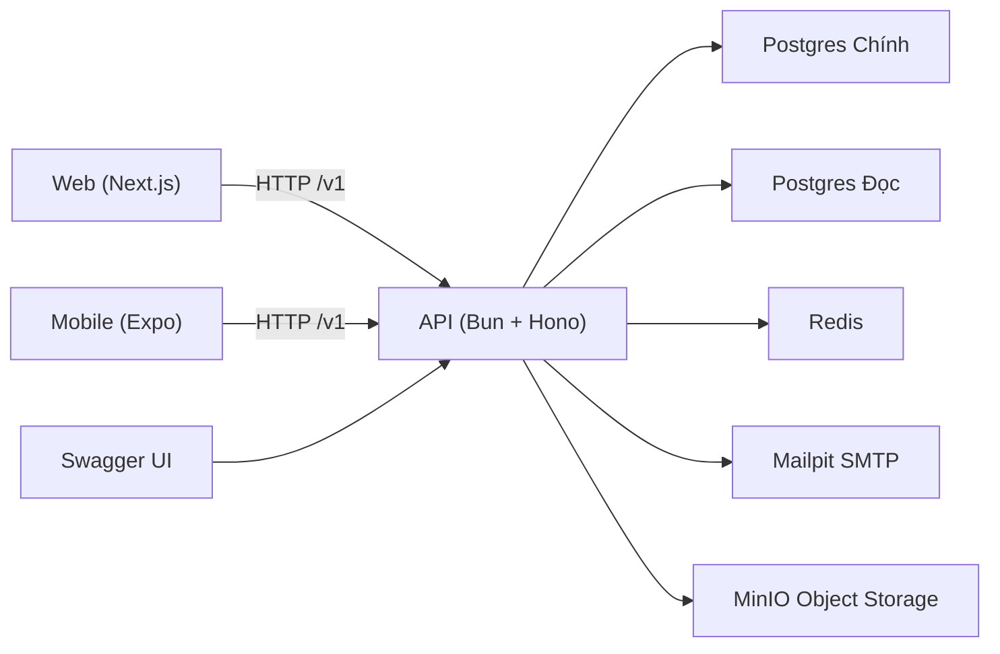

# Tài Liệu Tổng Quan Dự Án Em Plus

## 1) Mục tiêu dự án

Em Plus là nền tảng hỗ trợ hành trình tình yêu đa nền tảng (Web + Mobile) với backend tập trung, hướng tới 3 mục tiêu cốt lõi:

1. Xác thực và ghép đôi an toàn bằng email/mật khẩu + mã mời.
2. Đồng hành hằng ngày qua dashboard, timeline kỷ niệm và gợi ý chăm sóc cảm xúc.
3. Dễ vận hành nội bộ với hạ tầng local đầy đủ: Postgres chính, Postgres đọc, Redis, Mailpit, MinIO, Swagger.

## 2) Phạm vi hiện tại

Phạm vi đã triển khai trong code:

1. Xác thực `email + password` (luồng chính, không dùng đăng nhập Google ở thời điểm hiện tại).
2. Ghép đôi bằng mã mời một lần, có hết hạn.
3. Dashboard cặp đôi: số ngày yêu, sự kiện sắp tới, gợi ý hành động.
4. Timeline: tạo và xem danh sách kỷ niệm có phân trang.
5. Chăm sóc cảm xúc theo ngữ cảnh chu kỳ (nữ cập nhật chu kỳ, nam nhận gợi ý đã chuyển đổi).
6. Báo cáo sức khỏe phụ thuộc hệ thống (`database`, `readDatabase`, `redis`, `mail`, `minio`).
7. Cơ chế migration CSDL và lệnh chạy toàn bộ hệ thống.

## 3) Cấu trúc monorepo

```text
emplus/
├─ api/        # Backend Bun + Hono
├─ web/        # Next.js (landing + studio)
├─ mobile/     # Expo Router (3 tab chính)
├─ docs/       # Tài liệu
└─ scripts/    # Script chạy nhanh từ thư mục gốc
```

## 4) Kiến trúc tổng thể

**Sơ đồ dạng văn bản (ASCII):**
```text
  [ Web (Next.js) ]       [ Mobile (Expo) ]       [ Swagger UI ]
          │                       │                      │
          └───────────┬───────────┘                      │
                      │ (HTTP /v1)                       │
                      ▼                                  ▼
            [ API (Bun + Hono) ] ◀───────────────────────┘
                      │
      ┌───────────────┼───────────────┬───────────────┐
      │               │               │               │
      ▼               ▼               ▼               ▼
[ Postgres ]    [ Redis ]       [ Mailpit ]     [ MinIO ]
(Chính & Đọc)   (Cache/Session) (SMTP)          (Storage)
```

**Biểu đồ Mermaid:**


## 5) Thành phần backend

### 5.1 Router và module

`api/src/app.ts` mount các nhóm API:

1. `/v1/auth`
2. `/v1/couples`
3. `/v1/dashboard`
4. `/v1/timeline`
5. `/v1/care`
6. `/v1/system`
7. `/health`
8. `/v1/docs` (Swagger, bật/tắt qua env)

### 5.2 Cơ chế xác thực

1. API tạo `accessToken` + `refreshToken` ngẫu nhiên khi đăng ký/đăng nhập.
2. `accessToken` được lưu ở bảng `user_sessions` với TTL 3600 giây.
3. Middleware `requireAuth` đọc header `Authorization: Bearer <token>` để nạp user.

### 5.3 Cơ chế dữ liệu và cache

1. Chế độ chạy chuẩn là `DATA_STORE=postgres`.
2. Redis dùng cho session cache, invite cache, dashboard cache.
3. Khi Redis lỗi runtime, store tự tắt Redis client và fallback về DB (không crash toàn bộ app).

### 5.4 Migration

1. Script migration: `api/src/db/migrate.ts`.
2. Theo dõi lịch sử bằng bảng `schema_migrations`.
3. Mỗi file `.sql` có checksum để ngăn sửa migration cũ đã chạy.

## 6) Mô hình dữ liệu chính

Bảng cốt lõi trong migration `001_initial_schema.sql`:

1. `users`: hồ sơ người dùng, giới tính, auth provider, password hash.
2. `user_sessions`: phiên đăng nhập theo access token.
3. `couples`: cặp đôi, mã mời, trạng thái mối quan hệ, mốc yêu/cưới.
4. `memories`: kỷ niệm theo cặp đôi, ngày kỷ niệm, mô tả, nhãn.
5. `emotional_cycles`: dữ liệu chu kỳ phục vụ engine chăm sóc cảm xúc.

## 7) Quy ước contract API

### 7.1 Envelope phản hồi

1. Thành công: `success=true`, trả `data`.
2. Lỗi: `success=false`, trả `error.code`, `error.message`.
3. Danh sách phân trang: có thêm `pagination`.

### 7.2 Enum hiển thị tiếng Việt

Hệ thống trả về giá trị hiển thị tiếng Việt cho client:

1. Giới tính: `NAM | NU | KHAC | KHONG_TIET_LO`
2. Trạng thái cặp đôi: `CHO_GHEP_DOI | DANG_YEU | DA_CUOI | DA_CHIA_TAY`
3. Trạng thái phụ thuộc: `HOAT_DONG | SU_CO | BO_QUA`
4. Ngữ cảnh cảm xúc nam nhận: `CHUA_CHIA_SE_CHU_KY | KY_KINH | GIAI_DOAN_NANG_LUONG | RUNG_TRUNG | CUOI_CHU_KY_NHAY_CAM`

## 8) Luồng nghiệp vụ chi tiết

### Luồng 1: Đăng ký và đăng nhập

Mục tiêu: tạo phiên làm việc hợp lệ cho người dùng.

Các bước:

1. Client gọi `POST /v1/auth/register` hoặc `POST /v1/auth/login`.
2. Backend chuẩn hóa email, kiểm tra mật khẩu, xác thực thông tin.
3. Backend lưu phiên vào `user_sessions` với TTL 3600 giây.
4. Backend trả `user`, `tokens`, `expiresIn`.

Điểm cần lưu ý:

1. `register` chấp nhận giới tính gửi lên dạng VN, đồng thời vẫn có normalize tương thích dữ liệu cũ.
2. `login` chỉ dùng provider `LOCAL`.

### Luồng 2: Ghép đôi bằng mã mời

Mục tiêu: kết nối 2 tài khoản thành 1 cặp đôi đang hoạt động.

Các bước:

1. Người A gọi `POST /v1/couples/generate-invite`.
2. Backend tạo hoặc lấy `couple` trạng thái `PENDING`.
3. Backend phát mã mời mới, thu hồi mã cũ trong Redis nếu có.
4. Người B gọi `POST /v1/couples/join` với mã mời.
5. Backend xác thực mã còn hiệu lực, chưa bị thay thế, chưa tự ghép chính mình.
6. Backend cập nhật `couple` sang trạng thái `DATING`, gán `partner2Id`, xóa mã mời.
7. Backend trả thông tin đối tác và trạng thái cặp đôi dạng hiển thị tiếng Việt.

### Luồng 3: Dashboard trang chủ

Mục tiêu: cung cấp trạng thái quan hệ và hành động gợi ý trong ngày.

Các bước:

1. Client gọi `GET /v1/dashboard/home` (cần bearer token).
2. Backend lấy quan hệ đang hoạt động của user.
3. Backend kiểm tra cache trang chủ theo `coupleId` (TTL 15 phút).
4. Nếu cache trống, backend tính:
   - `loveDays` từ `loveStartDate`
   - sự kiện sắp tới từ anniversary engine
   - câu quote + action hint
5. Nếu user là nam và có dữ liệu chu kỳ của đối tác, action hint sẽ theo emotional engine.
6. Backend lưu cache và trả payload dashboard.

### Luồng 4: Timeline kỷ niệm

Mục tiêu: lưu và xem lại các cột mốc tình yêu.

Các bước:

1. Tạo kỷ niệm: `POST /v1/timeline/memories`.
2. Backend kiểm tra user đã ghép đôi, validate `title` và `memoryDate`.
3. Backend lưu bản ghi vào `memories`, xóa cache dashboard của cặp đôi.
4. Xem danh sách: `GET /v1/timeline/memories?page=&limit=&order=`.
5. Backend trả dữ liệu có phân trang.

### Luồng 5: Chăm sóc cảm xúc

Mục tiêu: chuyển dữ liệu chu kỳ thành gợi ý quan tâm thực tế.

Nhánh A (nữ cập nhật chu kỳ):

1. Gọi `POST /v1/care/female-cycle`.
2. Backend chỉ cho phép user có giới tính nội bộ `FEMALE`.
3. Validate `lastPeriodStart`, `avgCycleLength`, `avgPeriodLength`.
4. Lưu vào `emotional_cycles`.
5. Xóa cache dashboard để cập nhật gợi ý mới.

Nhánh B (nam lấy gợi ý):

1. Gọi `GET /v1/care/male-suggestions`.
2. Backend chỉ cho phép user có giới tính nội bộ `MALE`.
3. Lấy cycle của đối tác và xác định phase.
4. Engine chuyển phase thành gợi ý + call-to-action.
5. Trả ngữ cảnh hiển thị tiếng Việt và danh sách gợi ý.

Lưu ý bảo mật nghiệp vụ:

1. Nam không đọc dữ liệu chu kỳ thô.
2. Dữ liệu nhạy cảm được chuyển thành insight hành động.

### Luồng 6: Theo dõi phụ thuộc hệ thống

Mục tiêu: biết nhanh môi trường nào đang lỗi khi chạy local hoặc staging.

Các bước:

1. Gọi `GET /v1/system/dependencies`.
2. Backend kiểm tra đồng thời `database`, `readDatabase`, `redis`, `mail`, `minio`.
3. Trả kết quả gồm `status`, `latencyMs`, `details` theo từng phụ thuộc.
4. Nếu có phụ thuộc trạng thái nội bộ `down`, endpoint trả HTTP `503`.

## 9) Luồng chạy toàn bộ hệ thống local

Lệnh chuẩn:

1. Từ thư mục gốc: `bun run dev:local`
2. Hoặc từ backend: `cd api && bun run dev:all`

`dev:all` thực hiện:

1. Tự tạo file env còn thiếu (`api/.env`, `web/.env.local`, `mobile/.env`).
2. Chọn cổng trống cho API/Web/DB/Redis/Mail/MinIO/Mobile.
3. Bật docker service: Postgres chính, Postgres đọc, Redis, Mailpit, MinIO.
4. Chạy migration + seed cho DB chính và DB đọc.
5. Chạy song song API, Web, Mobile.
6. In toàn bộ URL dịch vụ để truy cập nhanh.

## 10) Biến môi trường cốt lõi

Backend (`api/.env`):

1. `DATA_STORE`, `DATABASE_URL`, `READ_DATABASE_URL`, `REDIS_URL`
2. `MAIL_HOST`, `MAIL_PORT`, `MAIL_FROM`
3. `MINIO_ENDPOINT`, `MINIO_ACCESS_KEY`, `MINIO_SECRET_KEY`, `MINIO_BUCKET`
4. `SWAGGER_ENABLED`, `SWAGGER_PATH`
5. `ALLOW_MOCK_OAUTH` (chỉ bật trong `test`)

Web:

1. `NEXT_PUBLIC_API_BASE` (mặc định local: `http://localhost:3000/v1`)

Mobile:

1. `EXPO_PUBLIC_API_BASE` (mặc định local: `http://localhost:3000/v1`)

## 11) Bảo mật và nguyên tắc kỹ thuật

1. Luồng thật ưu tiên `email/password`, không dùng mock/fake cho nghiệp vụ chính.
2. `ALLOW_MOCK_OAUTH` không bật mặc định ngoài môi trường test.
3. `DATA_STORE=memory` bị chặn khi không phải test.
4. Mã mời cũ bị thu hồi khi phát mã mới.
5. TTL phiên phản hồi cho client phải khớp TTL lưu backend.

## 12) Kiểm thử và chất lượng

Bộ lệnh xác nhận nhanh:

1. `bun run --cwd api test`
2. `bunx tsc -p api/tsconfig.json --noEmit`
3. `bun run --cwd web typecheck`
4. `bun run --cwd web build`
5. `bun run --cwd mobile typecheck`

## 13) Tài liệu liên quan

1. PRD và kiến trúc: `docs/01_prd_and_architecture.md`
2. API chi tiết: `docs/04_api_specifications.md`
3. UI guideline chung web/mobile: `docs/09_shared_ui_guideline_web_mobile.md`

